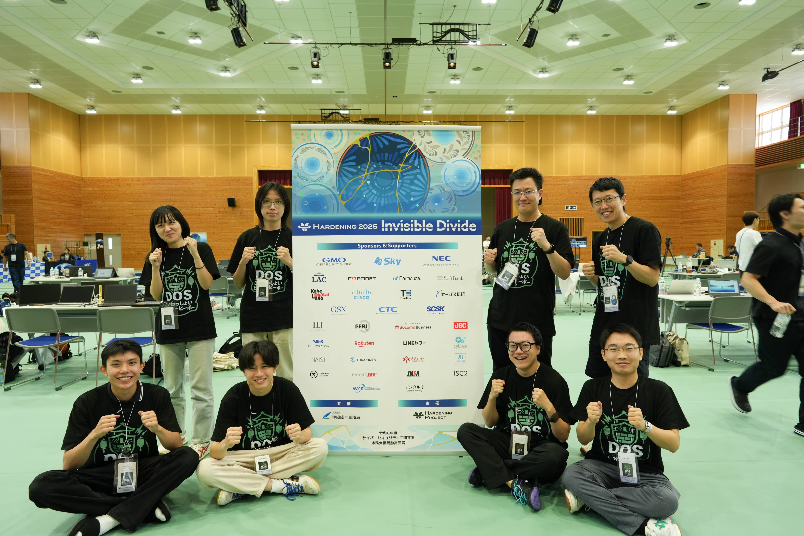
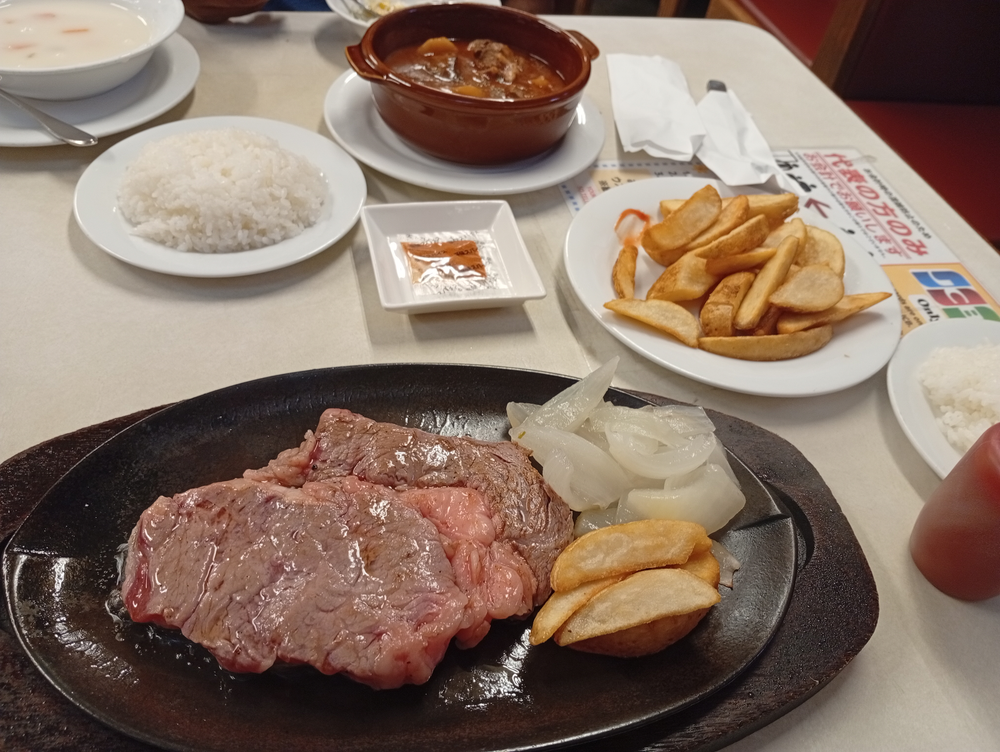

--- 
title: "Hardening Project: My First Cybersecurity Competition"
pubDate: 2025-10-15
updatedDate: 2025-10-15
description: "What I learned stepping into my first cybersecurity competition as a complete beginner — in Japanese, in Okinawa, under real attack."
tags: ["Cybersecurity", "Blue Team", "Competition", "Japan"]
show: true
---

# Hardening Project Invisible Divide 2025

When Eyes Japan offered to sponsor me to participate in the Hardening Project — Japan's premier blue-team cybersecurity competition — I said yes before I fully understood what I was signing up for. Everything would be in Japanese. I had never done anything like this before. And I was about to go up against real attackers trying to tear down systems I was responsible for protecting.

It was exactly the kind of challenge I needed.

## What is the Hardening Project?

The Hardening Project is an annual cybersecurity competition held across Japan, where mixed teams of engineers must defend a live business infrastructure from a coordinated red team of attackers. This year's event 'Invisible Divide 2025'' was held in Okinawa.

The format spans three days:

- **Day 1** — Teams harden their assigned systems and brace for 8 hours of relentless live attacks
- **Day 2** — Teams analyze the attacks, assess what happened, and prepare slides covering their preparation and incident response
- **Day 3** — Each team presents their experience, the attackers reveal the vulnerabilities they exploited, and the winning team is announced

Scoring is based on sales, the team that kept their servers running and 'selling' the most wins.

## Preparing as a Beginner

I want to be honest: going into this, I was a novice in cybersecurity. It was going to be in Japanese. The technical scope was enormous. I could have let that be a reason not to go. Instead I treated it as a reason to prepare harder.

In the month leading up to the competition, our team held weekly meetings to divide responsibilities, plan what tools and scripts to prepare in advance, and design our roles for the event itself. I spent that time doing my own mock hardening exercises and studying the specific attack surfaces I'd be responsible for, learning quickly that being uncomfortable is where most of the real growth happens.

## My Role on the Day

My responsibility during the hardening phase was **endpoint security for our CMS websites**, configuring `.htaccess` files, auditing server configs and README files for exposed credentials or misconfigurations, and removing outdated or unused plugins that could serve as entry points.

For my specific scope, the preparation paid off. But the system we were defending was enormous, spanning countless servers across multiple OS environments, and no amount of individual preparation could substitute for what we were missing as a team.

## What Went Wrong and What I Learned

We came last. And I think it's worth talking about why, because the lessons were more valuable than a trophy would have been.

**Lesson 1: Tooling and visibility matter as much as skill.**
The hardest part of the day wasn't knowing what to do, it was knowing *where to look*. With so many servers running simultaneously, tracking which ones were up, which had gone down, and which had been compromised was nearly impossible without proper monitoring tooling. A centralized server health dashboard would have changed everything. This was my biggest practical takeaway: in a real incident, visibility is your first line of defense.

**Lesson 2: Incident response only works as a team.**
When things started going wrong, we all instinctively went heads-down independently trying to find the source of the breach. It didn't work. Proper incident response requires real-time communication, someone coordinating, someone documenting, someone triaging. The absence of that structure cost us. I left with a much deeper appreciation for why incident response planning and clear communication protocols exist in professional security teams.

**Lesson 3: Specialization is real, and depth matters.**
Watching the experts on our team ,and the attackers during their debrief, was genuinely humbling. DNS servers, mail servers, reverse proxies, firewalls, each running across different operating systems, each with its own attack surface. Real cybersecurity expertise is deep and hard-won. I came away with far more respect for the field and a clear understanding of how much there is still to learn. More importantly, it lit a fire in me to approach any technical specialization with that same level of seriousness.

## The Result

We might have landed in last place, but I walked away with priceless experience and ,arguably better,a consolation prize of a premium Okinawa melon! We won a sponsor award for our "never-give-up" attitude, and I’m still thinking about how good that melon was.

In all seriousness though, landing last at a competition full of cybersecurity professionals while being a complete newcomer to the field is not something I'm embarrassed about. I showed up, contributed, and walked away with lessons that would have taken years to learn any other way.

## Okinawa

It would be a disservice not to mention that Okinawa itself was wonderful. The food was great: steaks, burgers, and some of the best beer I've had. Between the genuinely beautiful ocean and a traditional Okinawan musical performance unlike anything I'd experienced before, it was an incredible trip. Bonding with teammates over a BBQ next to the water, exploring the shops, and picking up souvenirs all added up to one of the most memorable journeys I've taken since moving to Japan.

## Takeaway

This experience reaffirmed something I try to live by: the best growth happens when you step into rooms where you're not yet qualified to be. I came in as a software engineer with no cybersecurity background. I contributed where I could, failed in instructive ways, and left more capable and more curious than when I arrived.

If the opportunity comes around again, I'll be there. I will be better prepared and ready to prove myself.
