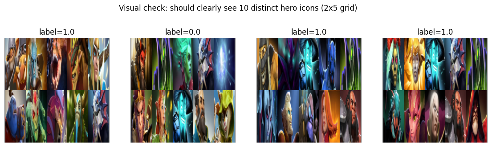
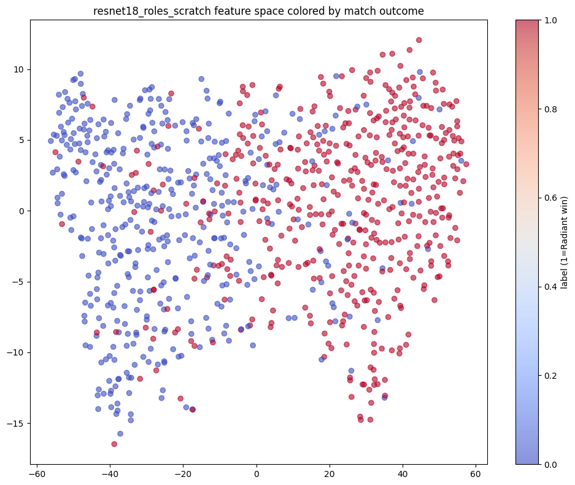

I always thought that if a draft mattered as much as players claim it does, a model trained on nothing but hero picks would prove it decisively. That the hard part would be building the pipeline, and once the data was flowing, a clear signal would show up on its own.

I was severely mistaken.

Every Dota player has said it at some point. We already lost in the draft. It is one of the most repeated lines in the game, right up there with blaming a teammate, and like most folk wisdom about complex systems, it is asserted far more often than it is actually tested. I wanted to test it properly, using nothing but the draft itself, ten hero picks and nothing else, to see how much of the outcome that information alone could actually explain. This is the story of that project, the dead end that ate the first several weeks of it, the baseline that finally explained what was going wrong, and what the honest number turned out to be.

## Starting from Zero

The idea was simple on paper. Pull professional match data, encode which ten heroes were picked, and train a model to predict which side won. To make it a bit more interesting than the usual approach, I decided to represent each match as an image, hero icons arranged in a grid, rather than the plain categorical labels most existing work in this space uses. The hope was that a vision model might pick up on some subtle visual pattern, color palettes, silhouette shapes, something, that a flat list of hero names could never expose. In hindsight this was an ambitious starting assumption to build an entire pipeline around, but I wanted to find out for myself rather than take it on faith.

I pulled 5,939 professional matches from the OpenDota API, all restricted to a single patch so that hero balance changes wouldn't quietly contaminate the comparison. Each match became a 2x5 grid of hero icons scraped from Liquipedia, Radiant on top, Dire on the bottom, ordered by role so there would be some implicit positional structure baked into where each icon sat. I also built in the option to randomize that ordering later, as a way of testing whether position was actually doing anything.

Everything about the data pipeline looked reasonable. The model did not agree.

## The Model That Only Ever Guessed

The first version used a pretrained Vision Transformer, classification head swapped out, fine tuned on the hero grid images. Straightforward in theory.

It did not behave well.

Test accuracy landed on exactly 0.5285 or 0.4715, epoch after epoch, run after run, regardless of hero ordering. Those two numbers summing to exactly 1.0 was the first clue, that is the fingerprint of a model that has simply learned to output the majority class every time and nothing else. What made it worse was that training accuracy never moved either. A model that overfits shows rising training accuracy alongside flat test accuracy. This model couldn't even manage that. It wasn't learning the training set, let alone generalizing from it.

I worked through it methodically, the same way I'd approach a hardware issue with an unclear root cause. The problem turned out to be upstream, in how the images themselves were constructed. I had been assembling a full 2x5 grid of 224x224 hero icons and then squashing the entire composite image back down to 224x224 at the end, which crushed every individual hero portrait into a blurry, unrecognizable smear only a few pixels wide. No model, however capable, could have extracted useful features from that. I fixed it by resizing each icon to a smaller cell size before assembling the grid, so nothing got compressed into mush by a final resize, and made sure the normalization statistics actually matched whatever pretrained backbone was being used, since a mismatch there is exactly the kind of silent error that degrades a fine tune without throwing anything resembling a stack trace.

## Making Sure the Pipeline Wasn't Lying to Me

Cleaner images alone weren't enough to trust the results. Before touching the model again, I ran a full audit of the pipeline itself.

I confirmed a model could memorize a tiny eight example batch, since a model that can't do even that has something broken further upstream that no amount of real training will fix. I verified labels lined up correctly between the raw dataframe and what the dataset was actually returning at each index. I checked for duplicate matches, for hero id overlap between the two teams, which would point to a parsing bug, and for leakage across the train, validation, and test splits. I confirmed that the single patch claim actually held in the data.

Everything came back clean. That was reassuring in one sense and mildly frustrating in another, since it meant the weirdness I'd been seeing was a genuine modeling problem rather than a bug I could simply squash and move past.

## Chasing the Vision Approach Anyway

I wasn't ready to abandon the image based approach yet, so I ran a much wider sweep. ResNet18 pretrained and trained from scratch, ViT Base, ViT Small, ViT Tiny, DeiT3, Swin Tiny, frozen backbones, fully fine tuned backbones, lower learning rates, longer training, larger icon cells to reduce wasted padding in the grid.

The failure mode changed shape here, which was its own kind of progress. On the fine tuned ResNet and ViT runs, training accuracy now climbed steadily, sometimes past 90 percent, while test accuracy stayed pinned in the low 50s and test loss actually began rising over time. That is a textbook overfitting signature, the model memorizing exactly which hero combinations appeared in which training matches without learning anything that generalized to new ones. Adding early stopping on validation loss along with dropout and weight decay cleaned up the memorization cleanly, but the actual test ceiling never moved. Every architecture, every regularization setting, landed back in that same narrow band around 50 to 55 percent. Regularizing a model that never found the underlying signal in the first place just makes the failure slower and more well behaved. It does not make the signal appear.

## A Sneaky Split Imbalance

While digging through the results, I noticed something that had nothing to do with the model at all. Radiant wins more often overall in this dataset, about 52.4 percent, and my original random train, validation, test split had let that imbalance drift unevenly across the splits purely by chance. One test set landed at a 56.5 percent Radiant rate against training's 51.4 percent. That is a real problem, since a model can appear artificially better or worse just by happening to line up with whatever the test split's majority class was that day, which mattered a great deal given how many of my results were already sitting in that same narrow 53 to 56 percent range.

I swapped the plain random split for scikit learn's stratified train_test_split, which forces every split to preserve the overall win distribution. Rerunning the full sweep afterward, the story held up essentially unchanged, the vision models still stuck near chance, the baselines described below still landing in the mid 50s. That was good news delivered in a roundabout way. It meant the earlier conclusions hadn't just been an artifact of a lucky or unlucky split.

## A Properly Boring Baseline

At this point I needed a reference that had nothing to do with images whatsoever. So I one hot encoded which heroes were on which team and fit a Gradient Boosted Trees model on that alone.

Result: around 54.3 percent accuracy, 0.56 AUC.

Not a large number, but a real one, and it reframed the entire investigation. It confirmed the draft does carry some genuine signal, a modest edge, consistent with published work on picks only prediction. More importantly, this simple linear baseline found signal that every single vision architecture I had tried up to that point had completely missed. That pointed directly at the image representation itself as the bottleneck, not the underlying task.

To give the baseline a fair, direct neural counterpart, I built a small MLP with a learned embedding table for each hero id in place of the fixed one hot row, Radiant and Dire pooled separately and combined before a couple of dense layers. This landed around 54.5 to 55.5 percent at its best epoch, right in line with the boosted trees model, though it showed the identical overfitting shape if left training too long, the same early stopping fix applied here as it had for the vision models.

Two structurally different model families, one linear and tree based, one a small neural network with learned embeddings, independently converging on almost the same number, is a reasonably strong signal that this reflects something real about the data rather than a quirk of either model. It also lines up with published numbers from picks only prediction research elsewhere, which gives it an external anchor beyond internal consistency alone. The honest caveat is that a single stratified split, even a good one, is still one draw, and with roughly 890 test matches there is real sampling noise on the order of a percentage point or two. Repeated cross validation would tighten that estimate considerably, and is one of the more useful things left to do.

## Where the Vision Models Actually Looked

Once I had baselines I trusted, it was worth going back to the image models to see what they had actually been looking at, since accuracy wasn't going to improve from here regardless.

Saliency maps on the fine tuned ResNet and ViT models lined up perfectly with the accuracy story. Gradient attention was smeared diffusely across the entire 224x224 canvas, including the large empty padding region around the hero icons, rather than concentrated on the portraits themselves. A model that had genuinely learned to key in on hero identity should light up tightly on the icons and largely ignore the blank space around them. This one didn't. Which explains the numbers well, it never found a strong, localized, hero specific feature to grab onto in the first place.

## How This Stacks Up Against Published Work

Before treating 54.5 percent as a finished answer, I wanted to see where it fell relative to existing research on this exact problem.

Conley and Perry, one of the earliest papers in this space, reported 69.8 percent test accuracy using plain Logistic Regression on picks alone, drawn from around 18,000 mixed skill public matches. Semenov et al., the most cited systematic benchmark in this specific area, tested Naive Bayes, Logistic Regression, Gradient Boosted Trees, and Factorization Machines across multiple skill tiers, and explicitly found that accuracy depends heavily on player skill level. One genetic algorithm and logistic regression ensemble reported 74.1 percent, though the literature itself flags that result as unreliable given it was trained and tested on only 220 matches with no AUC reported. A separate line of that same body of work adds hand engineered hero interaction features, matchup, synergy, and countering, on top of raw picks, and that pushes plain picks only Logistic Regression from around 69.4 percent up to roughly 72.9 percent.

My 54.5 percent sits meaningfully below most of these numbers, and that gap deserved a proper look rather than a shrug.

A few real differences explain a good part of it. Most published work draws on 18,000 or more matches, considerably more than my 5,939. My dataset is professional matches only, on a single patch, specifically to remove skill variance from the picture, while most published benchmarks pull from mixed skill public matchmaking where skill gaps between players are far larger, which raises a genuinely interesting possibility that a lower draft only ceiling in professional data could be a real finding about skill equalized play rather than a shortcoming of the model. The game has also changed substantially since most of that research was published, Conley and Perry in 2013, Semenov et al. in 2017, a much larger map, reworked gold and experience systems, years of hero balance passes that have specifically smoothed out the hardest counters those older papers were built around. Comparing accuracy percentages across a decade of patches is something of an apples to oranges exercise for that reason alone.

The most direct gap, though, is feature engineering. Every version of my pipeline, boosted trees, embedding MLP, every vision architecture, only encodes which heroes are present. None of them explicitly encode how heroes interact with each other. The published work that clears 70 percent specifically adds synergy and counter terms on top of raw picks, exactly the kind of pairwise signal that a one hot vector or an averaged embedding pooling step tends to erase, since averaging embeddings together keeps a blurred sense of who's present while losing which specific pairs are actually interacting.

## What I Took Away

The draft does carry a small, real signal. We already lost in the draft has a kernel of truth to it, but it is a modest edge, not a dominant one, at least not in professional, single patch play. Turning that signal into an image actively hid it rather than revealing anything extra buried in the pixels, no matter which architecture, training regime, or hero ordering I threw at it.

Representation matters more than architecture. Five different vision backbones, at multiple sizes, pretrained and from scratch, frozen and fully fine tuned, all converged on the same ceiling, while a dead simple one hot encoding beat every one of them. The bottleneck was never model capacity. It was how the information was being presented to the model in the first place.

Get the baselines right before trusting anything fancier. The boosted trees model took an afternoon to build and did more to explain what was actually happening than several weeks of architecture sweeps. A boring, well understood baseline is often the fastest way to find out whether a harder problem is actually hard, or whether the approach is simply the wrong shape for the data.

Auditing the pipeline is not optional. A split imbalance quietly sitting a few points off center was enough to make some results look meaningfully better or worse than they actually were. The debugging instinct of checking the boring, unglamorous things first, labels, splits, leakage, before blaming the model, paid off here the same way it does with a physical system that's misbehaving for reasons that could be anywhere in the stack.

There is still real work left. Hero interaction features, ban data, cross validated confidence intervals, and testing whether hero ordering actually carries information are all open threads worth pulling on. If the draft really did decide the outcome before the game began, I would expect a number well above 54.5 percent. The truth is somewhere in between, the draft matters, just nowhere near as much as a frustrated post game lobby would have you believe.
