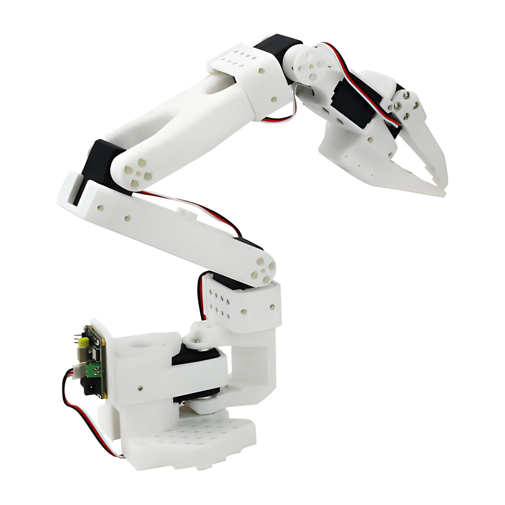

--- 
title: "Robotics Sim2real transfer"
pubDate: 2026-03-03
updatedDate: 2026-03-03
show: true 
description: "The most technically demanding project I've worked on, developing sim-to-real transfer pipelines for robotic arms and quadcopters, and what it actually takes to bridge the gap between simulation and the real world."
tags: ["Robotics","Sim2real","Isaacsim", "ROS2"]
--- 

I always thought that training a robot using reinforcement learning was the hard part. That once you had a working policy, you just dropped it into the physical robot and watched the magic happen.

I was severely mistaken.

I had the opportunity to work as the sole engineer on the sim-to-real section of the pipeline at Eyes Japan, and what started as one part of a larger project quickly became its own beast. As I realized just how large and critical this work would be, I eventually grew into the role of leading a small sim-to-real team. This is the story of that project, the problems, the breakthroughs, the two-day demo crunch, and everything I learned along the way.

## Starting from Zero

I want to be upfront: I had no prior experience with Isaac Sim, Isaac Lab, reinforcement learning, ROS2, or robotics of any kind. Everything I know about this domain, I learned on this project.

Before writing a single line of code, I researched how sim-to-real transfers typically work. I learned that RL policies deployed to physical hardware generally go through structured testing stages, Software-in-the-Loop (SITL) and Hardware-in-the-Loop (HITL), both concepts I was hearing for the first time. I mapped out weekly milestones, identified the gaps in my knowledge, and got to work.

I went in with naive determination. There were a lot of problems waiting for me.

## Sim-to-Sim: Building the Foundation

The first stage was sim-to-sim testing of the SO-101 robotic arm. I started by learning how to build a scene in Isaac Lab, import the SO-101 USD asset from the provided package, and write ROS2 nodes that could publish and subscribe to topics between the simulated arm and the policy. Getting clean bidirectional communication between the policy and the robot in simulation was the first real milestone.

Once that was stable, I set the simulated arm and the physical arm running side by side, subscribing to the same command topics so the physical arm would mirror the simulation. The growing pains here were manageable: learning ROS2 networking over WiFi, digging into the LeRobot repository to understand how to write to the arm's motor registers, and carefully matching policy observations to hardware sensor outputs in terms of units, ranges of motion, and action spaces.

## The Sim-to-Real Transfer

Then came the part I had been building toward, passing real sensor data from the physical motors directly into the policy and seeing how it behaved.

It did not behave well.

The arm oscillated violently. It moved at dangerously high velocities. There was significant lag between target changes and the arm's response. It would continue oscillating even after reaching a stationary target. I was looking at a wall of potential causes including motor misconfiguration, policy-to-hardware observation mismatches, ROS2 messaging delays, and timing issues, and I didn't yet have the intuition to know where to start.

I worked through it methodically. I implemented low-pass filters on both the incoming sensor data and outgoing actions to smooth out high-frequency noise, and added hard action clamps as a safety measure to prevent erratic movements from damaging the hardware. The raw velocity readings from the motors were too noisy to use directly, so I replaced them with estimates derived from positional differences between timesteps. When one motor failed mid-project I remapped it to the gripper motor which wasn't in active use, keeping the arm operational. I also implemented real-time object tracking using an onboard camera as the arm's target, which pulled me into learning hand-eye calibration, camera frame transforms, forward kinematics, and ROS2's TF tree.

## The Two-Day Demo

About six weeks into the project, with many of these problems still being actively worked on, I received a sudden request to prepare demo videos in two days.

I had to move fast and make pragmatic decisions. I simplified the arm's movement to the x-axis only, fixed joints that were contributing to instability, adjusted motor torque limits to prevent the erratic behavior that had been showing up under full freedom of motion, and aggressively optimized the ROS2 control loop.

One of the most impactful changes was decoupling the observation publishing loop from the action execution loop, running them independently rather than sequentially. I also tuned the ROS2 QoS settings to best_effort, dropped queue sizes to 1 to always use the latest state, and eliminated the lag that had been making the arm react slowly to target changes.

The demo came together. I also prepared a secondary video showing the view from a camera mounted to the arm's end-effector. Not perfect, but it demonstrated the pipeline working end-to-end under a real deadline.

## What Came After

After the demo, work continued on the harder problems that the simplifications had masked. Large oscillations persisted on the y and z axes, more complex to solve than x-axis movement since the dynamics and gravity compensation behave differently. The lag issue resurfaced in certain conditions and required further tuning. Motor calibration became a recurring investigation as hardware behavior drifted over time.

Each of these problems taught me something I couldn't have learned from reading alone. Debugging a physical system that's responding to a learned policy, where the source of error could be anywhere from the sensor data to the network to the policy itself, is a genuinely different class of problem from software bugs. You can't just read a stack trace.

## What I Took Away

This project fundamentally changed how I think about robotics and applied AI.

The sim-to-real gap is real and it is not small. A policy that looks perfect in simulation can behave completely differently on hardware. Domain randomization, careful observation matching, and systematic testing at every stage are not optional. They are the work.

Control loop design matters enormously. Small decisions about how often you sample, how you queue messages, and how you handle latency have outsized effects on physical behavior. I came to appreciate ROS2's QoS system far more than I expected to.

Tooling and observability are everything. The hardest part of debugging hardware issues is often just knowing what's happening. Investing in good logging, visualization, and monitoring early would have saved me significant time.

Stepping into a field cold and shipping something real is one of the fastest ways to learn. I don't recommend skipping the fundamentals, but there's a kind of knowledge you only get from having a physical robot oscillating in front of you and needing to fix it by tomorrow.

I'm proud of what we built. And I'm still learning from it.
