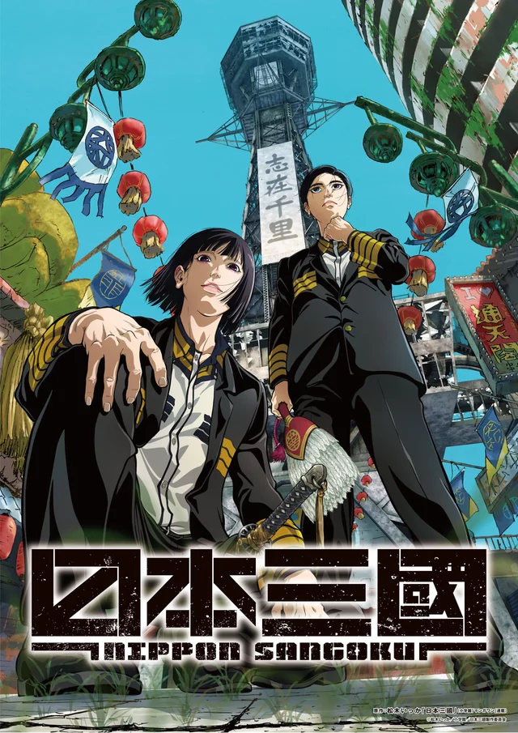

Nippon Sangoku might fly under a lot of people's radar this year, but wow, this anime scratched the Kingdom itch that no other series has managed to. Political intrigue, brilliant strategists, large-scale warfare, and constant battles of wit—it had almost everything I was hoping for.

## World Building

From the very first episode, I was completely hooked by the world.

Set in a post-apocalyptic Japan where modern technology has largely disappeared, society has regressed into something resembling feudal Japan. People farm the land, travel on horseback, and wage war with swords and spears, all while living among the remnants of modern cities. It's a fascinating premise that immediately grabbed my attention.

One detail I particularly loved was how little people actually know about Japan's past. History has become fragmented to the point where ordinary cultural practices are completely misunderstood. The protagonist even concludes from surviving books that ancient Japan must have been an intensely religious country because of traditions like visiting shrines, despite that interpretation being far removed from reality.

These moments are what make the world feel so unique. Familiar pieces of Japanese culture still exist, but their original meanings have been lost or twisted over generations.

The best example of this is Taira, one of the series' main antagonists. Seeing him casually flash the iconic Japanese peace sign—something normally associated with cheerful teenagers,immediately before ordering a horrifying execution is incredibly unsettling. It's such a memorable scene because it perfectly captures how symbols from the old world have survived while losing all of their original context.

## Story

The story feels loosely inspired by Romance of the Three Kingdoms, much like Kingdom, centering around the eventual unification of a fractured nation.

This time, however, our protagonist isn't a warrior striving to become the greatest general. He's a strategist, which was a refreshing change. Watching him outthink his opponents instead of overpowering them made many of the political conflicts especially engaging.

My biggest criticism, however, is the pacing.

Compared to Kingdom, everything happens remarkably quickly. In Kingdom, we spend countless chapters following Shin and his small group of friends as they slowly climb the military ranks. Every promotion, every battle, and every loss feels earned because we've spent so much time with the characters.

Nippon Sangoku moves at a completely different speed. The protagonist begins as an exceptionally capable strategist, is quickly placed in a position of influence, and before long his mentor, the very person he was destined to succeed, is already gone. Within a single season, he rises through the ranks at an incredible pace.

None of this is inherently bad, but I couldn't help feeling that the series rarely gives itself room to breathe. Characters are introduced, developed just enough for us to understand them, and then the story is already moving on to the next conflict. As a result, I never became as emotionally attached to the cast as I did in Kingdom.

In many ways, the show feels less like it's following one protagonist and more like it's telling the history of an entire nation, with the characters acting as pieces in a much larger narrative.

## Art Style and Visual Storytelling

Wow... just wow.

This might genuinely be one of the best-looking anime I've ever seen.

Beyond the high production quality, the art direction itself is incredibly distinctive. In an era where many anime share a similar visual style, Nippon Sangoku immediately stands apart. Its bold character designs, expressive animation, and unconventional compositions remind me of works like Ping Pong the Animation, shows that have a timeless visual identity rather than simply following current trends.

The visual storytelling is just as impressive.

The directing, editing, and shot composition constantly surprised me. Every scene feels dynamic and purposeful, using the medium of animation to enhance the storytelling instead of simply illustrating it.

One sequence that immediately comes to mind is an early execution scene where a man is pulled apart by horses. Rather than relying on graphic violence, the rapid editing builds tension before the final moment is obscured by a stark white background that is suddenly shattered by splashes of blood. It's a brilliantly directed scene that communicates the brutality far more effectively than explicit gore ever could.

Moments like these are why I think Nippon Sangoku makes exceptional use of animation as a storytelling medium. It isn't just beautifully animated, it understands how composition, editing, color, and motion can elevate a scene emotionally.

## Overall

I absolutely loved this first season.

It scratched the Kingdom itch that no other anime—or even live-action series—has been able to satisfy. Watching intelligent characters constantly trying to outmaneuver one another through politics, strategy, and warfare is exactly the kind of storytelling I enjoy.

My only real criticism is the relentless pacing. The series rarely slows down long enough for the audience to truly bond with its characters before they're thrown into the next battle—or killed off entirely.

One of Kingdom's greatest strengths is the gradual development of Shin and his companions. Because we spend so much time watching them grow together, every promotion, every victory, and every sacrifice carries enormous emotional weight. Nippon Sangoku hasn't quite reached that level for me yet.

That said, this feels like the beginning of something special. If future seasons allow the characters a little more room to breathe while maintaining the incredible world-building, strategic battles, and stunning visual direction, I could easily see this becoming one of my favorite anime.

I'm already looking forward to the next season, and I genuinely hope it surpasses my expectations.
