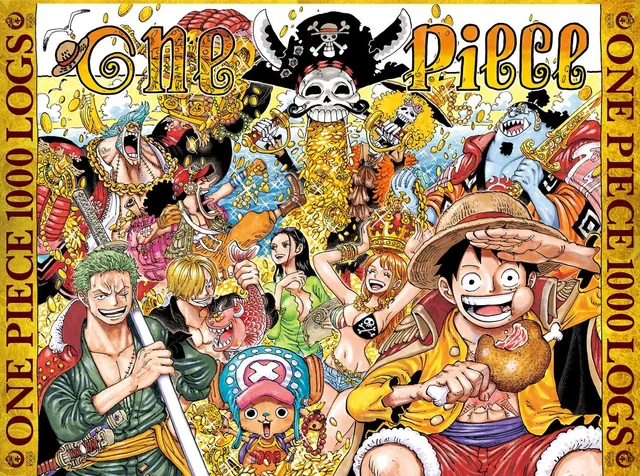

--- 
title: "One Piece "
pubDate: 2025-03-21
updated: 2025-03-21
rating: "10.0"
--- 

--- 

What can I say about One Piece that hasn't already been said?

If you've seen the photos on the home page, you might already have a good guess at how I feel about it. It's my favourite anime of all time, and that spot will probably be cemented permanently once it actually finishes, I hope it never does (I'm ready for Two Piece).

## A Late Convert

Unlike a lot of fans who grew up with it, I came to One Piece late. I got into it around the time Whole Cake Island was airing, and it was actually the last of the Big 3 that I watched. I'd already seen Naruto and Bleach and plenty of other popular shounens, but One Piece's premise never really grabbed the younger version of me.

I'd even tried watching it before and made it as far as Orange Town before quietly giving up. Whether it was boredom or one too many fans finally wearing me down, I eventually decided to just push through the early arcs and commit (I was watching the original sub, not One Pace so excuse my younger self lack of patience).

It was probably the best decision of my life.

## What Makes It Different

I don't think I've ever felt as attached to a group of characters as I do to the Straw Hats, in any piece of media, not just anime. Watching them grow together, be there for each other through every high and low, is something I genuinely wish I could experience again for the first time.

The highs of One Piece are, in my opinion, untouchable. Water 7 into Enies Lobby. The Marineford War. Wano. Arc after arc of storytelling that builds and pays off in ways that still catch me off guard.

But what really sets Oda apart from other shounen writers isn't the fights. It's the character moments. The ones that stick with you long after the episode ends. "I want to live." "Nothing happened." Luffy and Usopp fighting in Water 7. Nami breaking down and asking for help in Arlong Park. Luffy losing everything and slowly pulling himself back together on Amazon Lily. Those are the moments One Piece is made of, and no one writes them quite like Oda does.

## Episode 1015

This isn't meant to be a comprehensive review, just my honest thoughts. But I have to talk about episode 1015 and chapter 1000, because they are my favourite pieces of One Piece media and my favourite episode of anime ever.

Megumi Ishitani, the episode director, needs to be directing every major episode from here on out. It is perfect from start to finish, and I genuinely cannot count how many times I've rewatched those two entries alone.

Watching Luffy finally reach the rooftop in Wano, arriving in *that* fashion, was insane. It made me stop and reflect on everything: East Blue, the Grand Line, every island and every crew member and every moment of suffering that led to this point. And now, facing not one but two Yonkos of the sea.

The pride and emotion of that moment is hard to put into words. It's not just a amazing feat within the story. It's a testament to Oda's writing and to One Piece's longevity, which is genuinely unmatched in the medium or any medium in my opinion. 

## More Than Just an Anime

The Straw Hats' journey through the story loosely mirrors my own life in ways I didn't expect. The struggles, the growth, the moments where you have to push forward even when everything feels impossible, not just physically, but emotionally too.

When they finally achieve their dreams, I'm certain I'll be in tears.

And by that time, I hope I'll have achieved mine too.

