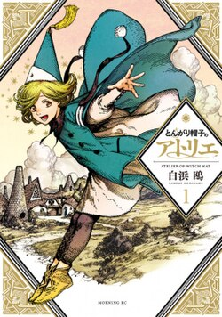

*

*Witch Hat Atelier* was one of the better fantasy anime I've watched in a while. What really stood out to me was the magic system. It feels unusually fleshed out, creative and, most importantly, like it actually belongs to the world. There's also a much more sinister side to magic than you usually see in fantasy anime. We've obviously seen dark fantasy before, and *Dorohedoro* immediately comes to mind, but in that case the darkness mostly comes from the world itself: the violence, the grotesque setting, the human experiments and the general "what the hell is happening here?" atmosphere. *Witch Hat Atelier* does something a little different by making **magic itself** feel dangerous. Not because magic is inherently evil, but because of what people are capable of doing with it, and I really liked that.

## The Magic System

The biggest reason I enjoyed *Witch Hat Atelier* was probably its magic system. I love when a fictional world's rules actually make sense within the world itself. When the characters understand the rules, when those rules have consequences, and when you can imagine how people living in that world would naturally build their lives around them, the setting starts to feel much more alive. *Witch Hat Atelier* does this extremely well.

One thing I particularly liked is the absence of the usual mana system that seems to exist in almost every fantasy setting. There's no giant blue bar above everyone's head saying, "This wizard has 10,000 mana, therefore he wins." Instead, magic is much more dependent on the actual spell itself and how you use it. Your creativity matters, your ability to draw matters, how quickly you can draw matters, preparation matters, and understanding how different circles interact matters. Suddenly, power scaling becomes much more interesting because someone who isn't necessarily the "strongest" wizard could still win simply because they are more creative, prepared the right spell beforehand, or managed to draw their magic circle faster.

That makes the magic feel much less like a conventional RPG stat system and much more like an actual skill. It almost feels like a natural phenomenon that humans have stumbled across and learned how to harness, in a similar way to how we discovered and learned to use electricity. I don't think I've seen many fantasy stories approach magic quite like this, and I really like how it makes the system feel less like a collection of predetermined powers and more like something that can actually be studied and developed.

## Magic Circles Are Basically Magical Circuits

I also really liked how the magic circles themselves function almost like electrical circuits. You aren't simply saying some magic words and shooting a fireball; you're essentially designing a little magical machine. Different parts of the circle have different functions, and combining them produces different effects. Even seemingly tiny changes can completely alter what a spell does.

The flying shoes are probably one of my favourite examples of this. The characters can use magic circles in their shoes, and when the circles are completed by bringing the shoes together, they produce wind that allows them to fly. It's such a simple idea, but it really sells the whole concept of how magic works in this world. Magic isn't just something you cast; it's something you **design**.

That opens up an absurd number of possibilities. A small change to a circle could potentially completely change how a spell works, which means the limits of magic aren't necessarily determined by how many spells you have memorized. Instead, they're determined by how creative you are and how well you understand the underlying system. That's what makes the magic so fun to me, because it feels like there are potentially countless applications that haven't even been discovered yet.

## The Freedom of Magic

This is probably what I found most interesting about the system. It feels like there's an enormous amount of freedom because the magic circles can be combined and modified in so many different ways. The same basic principles can potentially be used for completely different purposes, which makes the world feel like it has a lot of room to grow. You can imagine people discovering new applications for magic that nobody had thought of before, simply because someone approached an existing spell or circle from a different perspective.

At the same time, that freedom also makes the system a little scary. If magic is this customizable, what's stopping someone from using it for something horrible? The more I thought about the possibilities of the system, the more I started to understand why there are so many rules surrounding its use. The same creativity that allows someone to come up with an ingenious way to fly or solve a problem could also be used to create something extremely dangerous.

And that's where I think the show gets particularly interesting. The freedom of the magic system isn't just there to make the world more fun or give the characters cool abilities; it also creates the foundation for a much darker side of the story.

## The Morality of Magic

The entire premise of the show revolves around different factions disagreeing about how magic should be used and what restrictions should be placed on it. One of the major rules is that magic circles cannot be drawn directly onto a person, which initially seems like a fairly reasonable safety regulation. However, the more you think about what would happen if someone ignored that rule, the more understandable the restriction becomes. The character with the crooked hat towards the end of the season is a great example of this. Without getting too deep into spoilers, the things they are able to do with their body are genuinely unsettling, becoming seemingly invisible and almost non-corporeal. It immediately made me wonder what other ridiculous or terrifying things someone could accomplish if they were willing to ignore the rules.

This is where I think the magic system becomes particularly interesting. The possibilities seem almost limitless, but magic itself isn't inherently good or evil. It simply exists, and the morality comes from how people choose to use it. I actually find that much more interesting than a magic system where certain powers are simply classified as "evil magic." If the system itself has no moral alignment, then the same underlying principles can potentially be used for completely different purposes. You can use magic to heal someone, fly through the air, build something, or make everyday life easier, but you could also use those exact same principles to alter someone's body or create something genuinely horrifying. The magic doesn't care about any of this; it is the person using it who decides what it becomes.

I think that makes the world of Witch Hat Atelier much more interesting, because it creates a much more believable reason for why magic needs to be regulated. The danger isn't necessarily that magic is evil, but that humans have access to something with almost limitless potential and have to decide where the boundaries should be. That conflict between the freedom to experiment and the responsibility to prevent people from abusing that freedom is one of the aspects of the series I'm most interested to see explored further.

Really puts in perspective of 'Great power comes great responsibility'

## The Cliffhanger Ending

Now, the ending... what the hell was that? I'm not really sure why they decided to end the season where they did, but honestly, I don't mind it too much. If it was simply a pacing decision to make the season work better as a whole, then fair enough. I also never really got the feeling that it was done purely out of greed or as some cynical attempt to force people into watching the next season, which is probably why I don't mind it as much as I otherwise might.

That being said, it was an extremely blatant cliffhanger. I can't remember the last time I watched a TV show that ended with such an obvious "okay, now you have to watch the next season" moment. It genuinely felt like the anime just stopped, looked directly at me and said, "Alright, that's enough for now. Come back later."

And unfortunately for me, it worked. I definitely want to see what happens next, so I guess I'll be waiting for the next season.

## Overall

*Witch Hat Atelier* felt extremely fresh to me, not just within anime but within the fantasy genre as a whole.

The magic system is easily my favourite part of the show. It's one of the most fleshed-out and thoughtfully designed systems I've seen, and I love how much it feels like a natural part of the world rather than just a collection of cool powers.

More importantly, I really like the darker implications of it.The show doesn't need magic to be inherently evil to make it frightening. On the contrary it shows how humans can be frightening. Their little creativity can produce some of the most beautiful spells but at the same time also produce some of the most horrific ones and that's what makes the system so interesting.

There's obviously still a lot of story left to tell, and I'm very curious to see where the anime takes these ideas.

Right now, it's not quite at the level of some of my all-time favourite anime yet, but the potential is absolutely there.

If the story can continue building on this world and its magic system without losing the creativity and darker edge that made the first season so interesting, I could easily see *Witch Hat Atelier* reaching some seriously high heights.

I'll definitely be watching.
