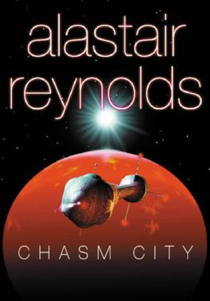

Alastair Reynolds has done it again.

I've only read a few of his books so far, but there's something I really love about the way he writes science fiction. He can throw around absolutely ridiculous ideas,immortality, genetic engineering, post-human societies, alien civilizations, technological gods, and somehow make them feel completely natural.

That's probably my favourite thing about Reynolds. He's still, at heart, a storyteller.

The interesting sci-fi ideas aren't the story. They're *part of the story*. They exist naturally within the world and the characters rather than feeling like an excuse to show off some cool futuristic technology. And I think that's what makes his books so immersive for me.

*Chasm City* was no exception.

## Story

One of the things I've come to really enjoy about Alastair Reynolds is that, despite how complicated his worlds can become, there is usually a very straightforward story underneath everything.

In *Chasm City*, we're thrown straight into the action, following multiple characters, timelines and storylines that initially seem disconnected. Tanner Mirabel arrives in Chasm City with almost no memory of who he is or what happened to him, and from there we're basically forced to discover the truth alongside him.

And I loved that.

Tanner is almost the perfect unreliable narrator for this kind of story. Because he doesn't know his own past, neither do we. His memories and assumptions initially feel like objective facts simply because we're experiencing the world through him.

But as little inconsistencies begin to appear, you start questioning things.

*Wait... is that actually what happened?*

Then another piece of information appears.

*Okay, maybe not.*

And eventually the truth starts coming together.

I really enjoyed that process. The book constantly made me wonder how Reynolds was going to bring all these different threads together, and by the end, I thought he pulled it off extremely well.

There are a *lot* of reveals in this book, and I think the story does a great job of making them feel like actual discoveries rather than random twists thrown in for shock value.

---

## Religion, Godhood and Manufactured Faith

This was probably my favourite part of the book.

There are so many interesting ideas about religion throughout *Chasm City*, particularly the idea of what religion might look like in a civilization where humanity has essentially acquired technology that starts approaching something resembling godhood.

The story constantly blurs the line between technology, religion and mythology.

The history of Sky's Edge is a great example. Sky Haussmann becomes almost a messiah-like figure, someone who saves people and builds a new society for them. But the more we learn about him, the more complicated that image becomes.

And then there's the whole concept of the religious virus.

I thought this was such a fascinating idea.

A virus that doesn't simply make people sick, but instead gives them glimpses into Sky's memories while gradually altering their brain chemistry and making them more devoted to him.

It's basically religion as a technological infection.

And the really interesting part is that it doesn't necessarily make the religious experience *fake*. The people affected are genuinely experiencing something. They're genuinely feeling their connection to Sky.

Which raises a pretty uncomfortable question:

**If you can manufacture someone's religious experience by directly changing their brain, does that make the experience any less real?**

I love science fiction when it can take something as ancient as religion and look at it from an entirely different technological perspective.

The Canopy and the Ultras are another great example.

These people have become so technologically advanced that concepts like aging and physical limitations barely apply anymore. They can modify their bodies, change their genetics and essentially become whatever they want.

Some of them even take on animal-like forms, which strangely reminded me of the traditional imagery of angels and cherubim.

At some point, when a human can alter their own body, live indefinitely and manipulate biology almost without limitation, the distinction between *human* and *god* starts becoming pretty blurry.

And I think Reynolds has a lot of fun sitting in that uncomfortable space.

## The Ghost Ship and Cosmic Horror

I honestly wasn't expecting the ghost ship storyline to go where it did.

At first, I thought it was going to be a creepy mystery within the larger story.

It became something much more terrifying.

The idea that no civilization has managed to reach interstellar travel because something stops them as soon as they become sufficiently advanced is genuinely horrifying.

It's classic cosmic horror, but with a very Reynolds-style science fiction twist.

What makes it particularly disturbing is the possibility that the universe isn't simply empty.

Maybe civilizations *are* out there.

Maybe intelligent life is actually quite common.

Maybe some civilizations have become incredibly technologically advanced.

And maybe something is just... eating them.

The idea of an alien lifeform that survives by mimicking civilizations and assimilating their technology, knowledge, beliefs and even their ships was one of my favourite concepts in the entire book.

The ghost ship section also had some of the best suspense in the novel for me. There's this constant feeling that something is wrong, but you don't really understand *what* is wrong until much later.

And when you finally understand what you're dealing with, it's much worse than I expected.

It's the kind of horror I really enjoy because the scary part isn't simply *the monster*.

It's the implications.

If something like this exists, what does that say about the universe?

## Human Politics in Space

Another thing I really liked was how incredibly *human* everyone remained despite all the technological advancements.

Humanity has immortality.

Humanity has incredible genetic engineering.

Humanity can travel between stars.

And yet...

Everyone is still fighting over information, political influence and tiny strategic advantages.

I particularly enjoyed the political and intelligence games surrounding the ships travelling to the same destination.

Everyone knows they're heading into an incredibly dangerous situation, yet they're still spying on each other, manipulating information, planning assassinations and trying to arrive before everyone else.

Even a few weeks or months of advantage can completely change the balance of power.

And Sky Haussmann takes this to an extreme.

The fact that he murders the sleepers aboard his own ship just to gain an advantage is horrifying, but also strangely consistent with the larger theme of the book.

Technology changes.

Human nature doesn't.

You can give humans immortality and the ability to manipulate their own biology, but apparently you can't stop them from being greedy, paranoid, territorial little animals.

Honestly, that's probably one of the most believable things about the entire book.

## Chasm City and the Melding Plague

And then there's Chasm City itself.

What an incredible setting.

The idea of a virus that primarily affects machines rather than humans is such a simple premise, but Reynolds does so much with it.

The city itself almost becomes a living organism.

Buildings twist and grow into strange shapes. Technology becomes unreliable or dangerous. Society has to adapt to a world where the machines that humanity had become completely dependent on can no longer be trusted.

People begin modifying animals to perform jobs that machines used to do.

People remove technology from their own bodies.

Some people live inside protective boxes just to avoid infection.

And the result is this bizarre combination of extremely advanced science fiction and almost primitive survival.

That's what I loved about Chasm City as a setting.

It feels simultaneously futuristic and post-apocalyptic.

The city is incredibly technologically advanced, but that technology has essentially turned against itself.

There's also something strangely beautiful about the way the Melding Plague changes the architecture. The infected structures become these bizarre, almost organic forms.

It's horrifying, but also fascinating.

The city feels *alive*.

## The One Thing I Wanted More Of

Despite how much I enjoyed the book, there was one thing I really wish Reynolds had explored more.

The revelation that Cahuella was actually Sky Haussmann.

I liked the reveal, but I almost felt like the implications of it were bigger than the amount of time the book spent exploring them.

Especially Gitta's reaction.

Finding out that the man she knew as Cahuella was actually this almost mythological figure from the history of Sky's Edge should be an absolutely enormous revelation for her.

And while the book does address it, I wanted more.

I wanted to sit with that revelation a little longer.

I wanted to see what it meant to her to realize who Cahuella really was.

It felt like there was another entire story hiding inside that revelation.

## Overall

I really loved *Chasm City*.

The story itself is great: the characters, pacing, mysteries, twists and reveals all work incredibly well. More importantly, all of the seemingly disconnected ideas eventually start fitting together, and by the end the whole thing feels much more cohesive than I expected it to.

But what really made the book for me was the ideas.

Religion as something that can be technologically manufactured.

Humans becoming so advanced that they begin to resemble gods.

The possibility of civilizations being destroyed the moment they become sufficiently advanced.

An alien organism that learns by consuming other civilizations.

Humanity remaining petty, violent and political despite becoming practically immortal.

And a city where technology itself becomes a disease.

There's so much interesting stuff here.

And yet, somehow, Reynolds never lets the ideas completely overwhelm the story.

That's probably why I'm enjoying his books so much.

He can give me a chapter about cosmic existential horror and the eventual fate of intelligent civilizations, and then immediately make me want to know what happens to Tanner next.

**Nevertheless, in true Alastair Reynolds fashion, I finished the book with a lot more questions about the universe than I had when I started—and I absolutely loved it.**
