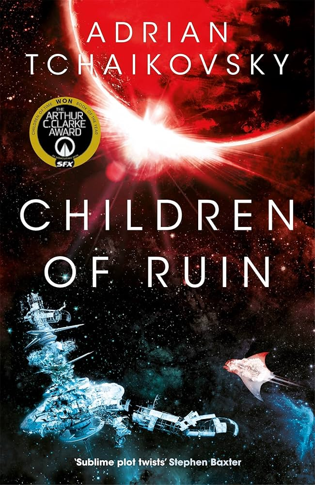

---

Children of Ruin is the second book in Adrian Tchaikovsky's Children of Time series, and it picks up in familiar territory. Another terraforming mission crew, another encounter with alien life, and another opportunity for Tchaikovsky to do what he does better than almost any other sci-fi writer: make you feel genuinely, uncomfortably alien to yourself.

## Something Truly Alien

One of the things I loved most about the first book was how it forced me to question things I take completely for granted, ideas about intelligence, communication, society, that I'd never thought to examine because they just felt like common sense. Children of Ruin does the same thing, and in some ways goes even further.

Tchaikovsky excels at writing perspectives that are not just foreign but structurally incompatible with human thinking. The octopuses are the centrepiece of that here. By this point in the series they have evolved into an extraordinarily advanced civilisation, capable of developing technology that can bend the fabric of space itself. And yet the way they actually function is almost baffling.

Their cognition is split between two systems that don't fully communicate with each other. Their central brain, what you might call the crown, operates on pure impulse and emotion. Meanwhile their arms, each with a degree of independent intelligence, do the actual problem-solving and execution. The result is that an octopus can perform incredibly complex actions without its central consciousness really understanding what it just did. It's less like thinking and more like willing something into existence. The arms figure it out. The crown just wants. From the outside it looks almost like magic, and from the inside it probably doesn't look like much of anything at all.

Their communication is equally hard to map onto anything human. On Earth we have hundreds of languages, but underneath all of them there are broadly shared structural features: subjects, objects, sequences of events in time. Octopus communication throws all of that out. They communicate through colour shifts and physical movement, which is already something we can barely conceptualise, but the deeper strangeness is that their messages don't follow chronological logic. Emotion and intent take precedence over sequence. The meaning is distributed across the whole performance rather than carried in any particular part of it, like a puzzle that has to be assembled before it makes sense. It genuinely made me stop and think about how much of what I consider "language" is actually just one very specific solution to the problem of communication.

The planet of Nod offers a different angle on the same idea. The alien life found there doesn't follow the evolutionary assumptions we carry around without realising it. No distinct genders. No reproduction in any sense we'd recognise. None of the basic biological characteristics we tend to assume any animal must have. Tchaikovsky uses Nod to quietly ask: why would alien life follow our rules? The answer, of course, is that it wouldn't. And sitting with that thought is genuinely unsettling.

## We Are Going on an Adventure

I did not expect this book to frighten me.

Going in off the back of the first book, I was prepared for big ideas and fascinating perspectives. I was not prepared for what the parasite does to this story. The concept of an immortal, massively reproducing bacterial organism that spreads through contact and gradually overrides its host's consciousness is horrifying enough on paper. The execution made it so much worse.

The infection sequence involving Lortisse and Lante is among the most effective horror writing I've encountered in sci-fi. It spreads from crew member to crew member with a quiet, unstoppable logic. Baltiel kills Lortisse with his own hands thinking it's over, and for a moment you believe it might be. Then the twist lands: Baltiel himself is already on a ship heading toward Senkovi, the parasite operating through him, keeping him functional and convincing enough to bypass any suspicion, until the moment it doesn't need to anymore. The line "we are going on an adventure," delivered in the voice of someone you thought was still a person, is one of the most chilling things I've read in recent memory.

What makes it so effective is the specific texture of the horror. The parasite isn't malicious in any meaningful way. It just wants to spread. It accesses the host's memories and uses them instrumentally, mimicking enough of the person to get through the door. There's no hatred in it, no cruelty, just an alien imperative that happens to be completely incompatible with human survival. That lack of intent somehow makes it worse.

## Overall Thoughts

Children of Ruin is a very good book, but I'd be lying if I said it landed as cleanly as the first one.

The ideas are as strong as ever. The octopus civilisation is endlessly fascinating, the parasite is genuinely frightening, and the collision between these two alien forms of intelligence makes for some remarkable sequences. But the second half of the book spreads itself thin. The narrative jumps between characters, locations and timelines in a way that started to blur together for me, making it harder to stay emotionally invested in what was happening moment to moment.

I also found myself wishing the book had leaned further into the octopus civilisation rather than pivoting toward something closer to a traditional antagonist in the parasite arc. The first book's greatest strength was sustained immersion in a radically non-human perspective. Children of Ruin gestures at that but splits its attention, and I think it's slightly weaker for it.

That said, Tchaikovsky remains one of the most genuinely thought-provoking writers working in sci-fi today. Even a slightly messier entry in this series leaves you seeing the world a little differently. That's not nothing. That's actually quite rare.
