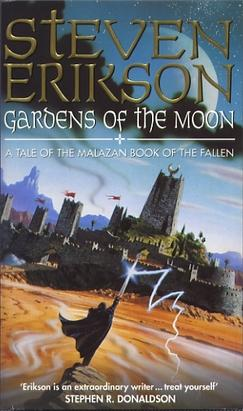

Having spent most of my reading journey rooted in sci fi, taking on *Gardens of the Moon* was a massive leap into the fantasy genre. I am not completely sure if I would recommend it as an entry point for absolute beginners, but it was an incredible start to my own fantasy voyage.

## World Building

The Malazan series is legendary for its sheer scale. With ten massive volumes in total, finishing book one made me realize that I have barely scratched the surface.

The shift from sci fi was immediate, mostly in the absurd number of characters and locations thrown at you right out of the gate. At first, trying to track every name, region, and magic term felt completely overwhelming.

I love expansive world building, but I had never tackled a multi volume series with a scope quite like this. Fortunately, the book balances its immense background lore by keeping the core action fairly contained. Instead of scattering characters across vast continents doing unrelated tasks, the story brings everyone together in Darujhistan for the second half. That convergence keeps the pacing tight and makes the alternating character perspectives feel interconnected rather than jarring.

One of my favorite moments was the dialogue between Tool and Adjunct Lorn. Getting that raw lore drop straight through their interaction was fantastic. I am not the type of reader who wants to study external wikis or glossaries just to grasp a story, so I really appreciate it when an author weaves the history and terminology right into the narrative itself.

## The Magic System

Magic is primarily referred to as "power" here, and the exact mechanics are kept under wraps. I might need to do a bit of light research later to fully grasp how it operates, but the mystery never took away from the fun.

I usually dislike fantasy books where the magic feels like a convenient, unexplained plot device that can suddenly solve any problem. *Gardens of the Moon* avoids that trap entirely. Even without a hard set of rules laid out, familiar concepts like wizards, alchemists, witches, barriers, and warrens give you just enough footing to follow along effortlessly.

The structure of the system is genuinely cool. The character classes are distinct, and the Ascendants and Gods carry a heavy Greek mythology vibe that I loved.

More importantly, magic is not an unbeatable cheat code. The balance in this world feels grounded. Mages are far from invincible; they are still mortal humans who can be caught off guard by a swift blade or a well timed assassination. Look at Paran: a normal human who plays arguably the most pivotal role in the story, standing up to Oponn and saving the Hounds from Darujhistan. That vulnerability makes the power dynamics dynamic and unpredictable, proving that even the strongest beings can fall to a clever plot or a pouch of Rallick's specialized powder.

## Characters

The cast is the true soul of this book. The complex schemes, political maneuvers, and overlapping agendas make the world feel alive, constantly keeping you guessing as every faction moves toward its own goal.

Anomander Rake is an absolute force of nature. The man walks through the plot like a literal living atomic bomb. An absolute unit wielding a massive two handed sword, his reputation precedes him in the best way possible. The initial clash between Moon's Spawn and the Malazan Empire was pure epic scale fantasy. Hearing the legends about him beforehand and then watching him live up to the title of Ascendant sold me completely on continuing the series. It set a sky high benchmark for what this world can deliver.

On the flip side, Kruppe easily stole every scene he was in. He is hilarious, memorable, and shrouded in just the right amount of mystery. Watching him maintain his delightfully eccentric personality while casually chatting with ancient elder gods who should be triggering existential dread is pure gold.

## Overall

*Gardens of the Moon* was a wild, incredibly fun ride that delivered on every level. It builds a colossal world without ever sacrificing pure entertainment value. I am completely hooked on this cast, eager to see where the peaks lead next, and ready to watch the epic saga of the Malazan Empire unfold.
