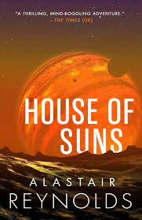

--- 
title: "House of Suns by Alistair Reynolds"
pubDate: 2026-01-26
updatedDate: 2026-01-26
rating: "9.3"
--- 

--- 

Sci-fi books have been a recent passion of mine. I've always loved the genre across other mediums, but books were a blind spot I hadn't really explored until recently.

When scouring the internet for must-read sci-fi novels, specifically ones that were relatively short and didn't require me to read an entire series or absorb a mountain of lore just to understand what was happening, Alastair Reynolds came up more often than not. House of Suns stood out immediately because it was a single, self-contained story. No homework required. Just pick it up and go.

I can safely say every recommendation was right.

## A Story That Earns Its Ending

House of Suns is a fantastic read with a genuinely satisfying ending, and spoiler alert, I was extremely relieved it was a happy one. The story builds great mysteries, lands some big twists, and explores ideas that stayed with me long after I finished it. It also does something I appreciate enormously: it resolves things properly. No loose threads left dangling as bait for a sequel that may never come.

As a pure story, the conspiracies, the characters, the reveals, it already works brilliantly on its own terms. The sci-fi elements almost fade into the background at times, feeling like a natural part of the world rather than concepts being shown off. Which is, I think, a real testament to Reynolds' ability as a writer.

## The Speed of Light as a Prison

What I enjoyed most was how the book plays with time, distance, and the hard limit of travelling at the speed of light.

I'd never really sat with how constraining that constant actually is, not in relation to human experience, but in relation to the sheer scale of the universe. Once the book made me feel that limitation, I couldn't unfeel it. Even the most advanced civilisations in House of Suns, capable of containing supernova blasts, developing cryotech, and editing and sharing memories like files, still cannot escape this fundamental boundary. All that progress, and they're still working within the same box we are.

There's something almost humbling about that idea.

The Vigilance took this even further. These beings are so physically enormous that when they need to just process a though, a nerve signal travelling at the speed of light takes several hours to cross their bodies. I had to stop and sit with that image for a moment. The sheer scale of something where a single thought is a multi-hour process is genuinely difficult to hold in your head, and Reynolds earns that sense of awe completely.

## Memory as a Version Control System

The memory-sharing system in the book also stuck with me, and not just as a sci-fi concept. It functions almost like a version control system for the human mind: commit your memories, share them with others, pull from a shared history, roll back or erase branches you don't want.

I think something like this is probably inevitable. Our brains simply don't have the physical capacity to store everything we experience across a long enough life, and at some point we'll likely need external systems to hold what we can't keep inside our heads. Memories you can archive and retrieve when you actually need them. Reynolds takes that idea seriously, builds real implications around it, and the result is one of the more thought-provoking concepts in the book.

## Final Thoughts

House of Suns is exactly what I was looking for when I started getting into sci-fi literature: a loveable cast of characters, a genuine mystery with satisfying payoffs, and ideas that quietly expand how you think about the universe without making you feel like you're reading a physics textbook.

If you're looking for a starting point for sci-fi books, this is a very easy recommendation.
