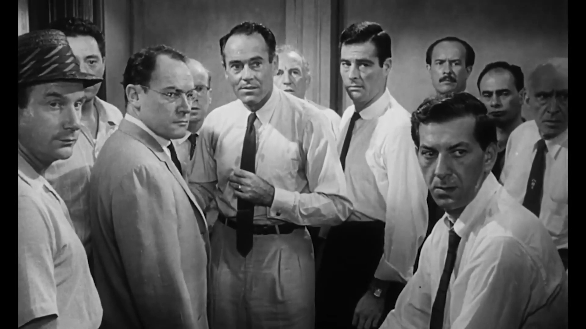

---

12 Angry Men is one of the most unique films I have ever seen. The premise is simple: a jury of twelve men must decide the fate of an eighteen year old boy accused of killing his father. Almost the entire runtime takes place in a single, cramped room. While that might sound boring, it is a masterclass in exposition, screenplay, and editing. These elements combine to keep the movie feeling dynamic. As the audience, we become the thirteenth member of the jury. We are slowly convinced as new information comes to light. Just like the jurors, we start to doubt our initial verdict as the story progresses.

## Exposition and Writing

The writing in this movie is exceptional. It is a rare case where "tell, don't show" actually works. The film relies entirely on dialogue and character interaction to reveal the facts of the case and the personalities of the men. If done poorly, this would feel forced. However, the dialogue feels natural and necessary. The script is incredibly tight because it uses the "unreliable narrator" trope. We only know what the jurors remember or interpret, which forces us to question the "truth" alongside them.

## Screenplay and Staging

The screenplay is incredibly intentional. Even with twelve men in one room, the movement of the characters feels fresh. A standout moment is the scene involving the prejudiced juror who bases his verdict on the defendant's race and upbringing. As he rambles about his biases and generalizes immigrants as violent, the other jurors silently leave the table one by one. This non verbal rejection is a powerful piece of storytelling. It signifies their refusal to listen to his hate without a single word being spoken. This is a perfect example of how the screenplay adds texture to the story through blocking and movement.

## Cinematography and Editing

The cinematography uses "visual claustrophobia" to great effect. As the heat in the room rises and the tension grows, the camera angles actually change. In the beginning, shots are wide and at eye level. By the end, the camera moves closer and uses lower angles to make the ceiling feel like it is pressing down on the characters.

There is a brilliant close up shot of the logical juror being questioned about the movies he saw. By staying on his face and not cutting away, the director creates a suffocating interrogation. It makes us feel the same pressure the defendant must have felt. It provides a vivid image of the original police interrogation without ever showing a single flashback.

## Character Dynamics

While some might argue the characters are one dimensional, this serves a specific purpose. Each man represents a different cross section of society or a specific human flaw: prejudice, apathy, logic, or personal trauma. The diversity of these archetypes allows for constant friction. It is this friction that advances the story. The characters do not even have names until the very end, which reinforces that they are symbols of the legal system rather than just individuals.

## The Message and the Legal System

The ending is inevitable because a "not guilty" verdict is the only way the story can resolve its themes of "reasonable doubt." The movie serves as a warning about how personal bias and prejudice can infect the pursuit of justice. It also shines a harsh light on the legal system. It suggests that the boy’s court appointed lawyer did a terrible job, leaving his life in the hands of twelve strangers who initially just wanted to go home. It reminds us that justice is not always about "truth," but about the high burden of proof required to take a human life.
