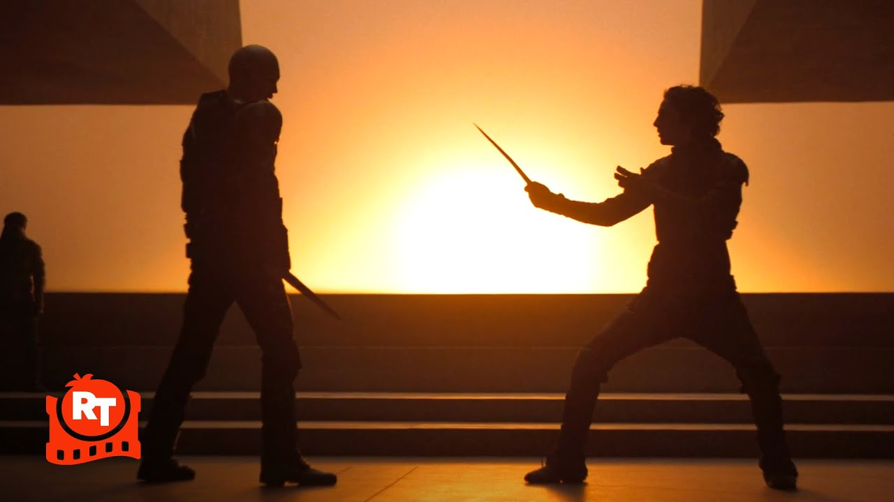

---

I had already watched Dune: Part One and Part Two before, but with the final film in the trilogy set to release at the end of this year, I found myself getting incredibly excited again. So I decided to rewatch the first movie. As usual with rewatches, I noticed new details and somehow fell in love with it even more.

## First watch

When I first watched Dune, I went in completely blind. Of course, I had seen all the positive discussion and reviews surrounding it, but I never let that pressure me into watching something before I was genuinely interested. I have found that forcing yourself to watch something just because it is popular often leads to not enjoying it fully. Timing matters to me. I need to be in the right mood. Once you watch something for the first time, you can never take that experience back.

Because of that, I waited until Dune: Part Two was already out before watching the first film. That way, I could experience both back to back without the long wait in between.

And honestly, I was shocked.

I did not expect to like it nearly as much as I did. The visuals, costume design, soundtrack, and acting all worked together to create a world that felt surprisingly convincing and real. Its clear inspiration from real world religions and grounded design choices tickled a part of my brain I did not even know existed.

## World building

World building was never something I paid much attention to before, but after watching Dune Parts One and Two, I found myself far more open to fully immersing in fictional worlds.

I think what made it stand out to me was how logical everything felt within the context of its world. Take the Fremen for example. Of course they place utmost importance on water, they live on an extremely harsh desert planet. When so many aspects of their lifestyle, culture, and clothing revolve around water scarcity, it becomes incredibly believable. From their clothing to be highly efficient water filtration systems, to their grave being a giant pool of their deceased moisture, I love when things just make sense.

Another example of this kind of logical world building is in Frieren. The introduction of magic shields countered traditional attack magic, which then led mages to exploit the shields' high mana requirements. They began using large scale physical attacks such as hurling rocks or massive volumes of water. This forced enemies to expend even more mana to defend themselves. That kind of logical evolution within a system makes the world feel alive and believable.

In my opinion, Dune Parts One and Two are perfect examples of this approach. The entire world feels grounded in foundational truths, and you can see those truths shaping everything. Culture, politics, architecture, and even character behavior all feel connected.

## Cinematography

Watching Dune again also made me appreciate the smaller details much more, especially the costume and set design. The costumes in particular were fantastic. I loved noticing parallels to real world clothing and history. For example, the Sardaukar outfits reminded me of crusader imagery, with their white armor and red symbols, while the Fremen carried clear Middle Eastern and Islamic influences. These inspirations felt thoughtful and appropriate given the context of the story.

On a second watch, I could also focus more on the cinematography itself. Every shot felt intentional. Nothing was wasted. The CGI and digitally created shots also deserve more credit. I especially loved the moments where scale was emphasized through depth and framing. People in the foreground highlighted the massive size of ships or structures.

The visual identity of each house was also incredibly well done. House Harkonnen had an almost alien and inhumane aesthetic. This extended beyond their appearance and into their environments. Their interiors felt barren, cold, and lifeless, as if not meant for human comfort.

In contrast, House Atreides felt grounded and familiar. Their spaces featured chairs, tables, and natural materials. You see water, mountains, wood, stone, metal, and grass. These elements feel alive and welcoming. The contrast between these two houses visually communicates their values without needing much explanation.

Rewatching Dune reminded me why I loved it so much in the first place. It is rare to find a film where every element works together so cohesively.

And now, with the final installment on the horizon, I honestly cannot wait to return to Arrakis one more time.
