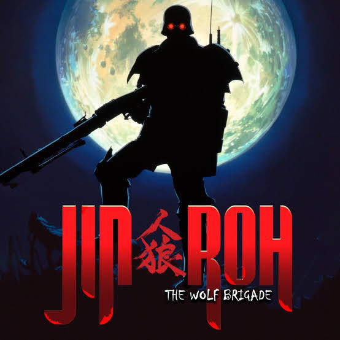

What if someone took your favorite childhood bedtime story, threw in alternate-history 1950s political paranoia, and geared everyone up in terrifying, glowing-red-eyed body armor? You’d get Jin-Roh: The Wolf Brigade, a film that proves fairy tales are a lot more intense when government conspiracies and heavy machine guns get involved.

## Little Red Riding Hood

At its heart, Jin-Roh is a dark, twisted re-imagining of Little Red Riding Hood. But instead of bringing goodies to Grandma, this version of "Little Red" refers to young female activists acting as couriers ("Little Red Riding Hoods") for an extreme anti-government group, delivering weapons, supplies, and satchel bombs through the sewers of Tokyo.

Our protagonist, Fuse, is a elite member of the Capital Police’s armored Kerberos unit. The story kicks off when he encounters one of these young couriers in the dark sewer tunnels. Unable to pull the trigger on her, he watches in horror as she detonates her bomb right in front of him. That single split-second pause sets the entire plot into motion.

## Military governed countries

If you love counter-intelligence, backstabbing, and shadowy agency power struggles, Jin-Roh delivers. The story takes place during a fragile post-war era where public trust in the government is at rock bottom, conspiracy theories are everywhere, and everyone is playing 4D chess.

The core conflict hinges on a high-stakes feud between the Secret Intelligence Service and the Military Police, where intelligence agents actively scheme to discredit the heavily armed Capital Police and strip them of their authority. To pull this off, both sides deploy an overwhelming barrage of decoys, double-crosses, and counter-intelligence traps. It creates a dizzying labyrinth of deceit where keeping track of who is playing whom on your first watch is nearly impossible, keeping the tension high right down to the final act.

## Human nature

Where the film truly shines is in its haunting exploration of human nature and identity, constantly pushing you to ask a central question: Is Fuse a wolf pretending to be a man, or a man pretending to be a wolf?

At first, he seems like a traumatized soldier battling his conscience after failing to shoot the young activist in the sewers. But as the plot thickens and the shadowy Wolf Brigade steps into the light, every motive is thrown into doubt. Was his initial hesitation a rare moment of genuine humanity, or just the first move in a cold, meticulously calculated ploy?

It’s easy to look at the ruthless machinery of the plot and assume Fuse was merely playing a role, but I like to believe his transformation was real. Even while caught in the web of his orders, the connection he develops with Kei feels far too genuine to dismiss as pure deception. That emotional core hits a devastating peak in the final act—when Kei is executed in his arms, Fuse’s agonizing scream of terror and heartbreak isn't the calculated reaction of a double agent. Captured with astonishing, raw animation detail in his facial expressions, that moment reveals the tragic truth: beneath the menacing armor, a human heart was genuinely breaking.

## Visual story telling

Beyond the narrative themes, Jin-Roh is a absolute tour de force in visual storytelling. The movie brilliantly uses imagery to depict Fuse’s symbolic degradation from a human being into an unfeeling beast. Early on, we see him stripped of armor, looking vulnerable and unmistakably human. But as the story pulls him deeper into the shadowy world of counter-intelligence, that humanity is steadily replaced by the stark, terrifying silhouette of the Kerberos unit. Those iconic, heavy body suits are cool in the most menacing way possible—especially when the red night-vision lenses glow through pitch-black sewers and thick smoke. Yet, what grounds all of this heavy sci-fi aesthetic is the shockingly grounded animation. The character designs resist over-the-top anime tropes in favor of photorealistic, subtle facial expressions. Micro-flinches, hesitations in movement, and subtle shifts in a character's eyes convey weight, fear, and intent far more effectively than dialogue ever could.

## Overall

Overall, Jin-Roh: The Wolf Brigade stands as a genuinely remarkable piece of dark, atmospheric cinema. The breathtaking hand-drawn art style, moody post-war setting, and intricate web of betrayal make for an unforgettable watch. Granted, the pacing can feel a bit slow at times, and if you're paying close attention, the final twists are more heavily telegraphed than truly shocking. But even when you can see the trap coming, it doesn't take away from the tragedy. It remains a brilliantly constructed story that lingers with you long after the credits roll.
