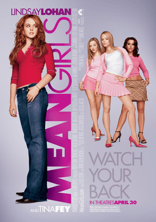

---

title: "Mean Girls (2004)"
pubDate: 2026-07-25
updatedDate: 2026-07-25
rating: "10.0"
---

When I was growing up, Mean Girls was a cultural phenomenon. Watching it again as an adult, I was surprised to find that I actually think it's even better than I remembered.

The jokes still land, the characters are endlessly quotable, and the satire feels just as sharp today as it did over twenty years ago.

## I Can't Believe It's a 2004 Movie

It's genuinely hard to believe that Mean Girls is now more than twenty years old. The screenplay, the humor, and the pacing all feel remarkably fresh. In some ways, I think the film is even funnier today because of how well its themes have aged.

The movie portrays high school as a social jungle where popularity dictates everything, and honestly, that feels even more relevant now. Social media has only amplified those dynamics. Bullying, chasing trends, obsessing over appearances, and carefully curating an online persona have become everyday parts of teenage life.

The Plastics feel less like an exaggerated caricature and more like an early prediction of influencer culture. The idea of presenting a polished, artificial version of yourself for validation is something that's arguably even more common today than it was in 2004.

## Progressive Characters Done Right

One thing that stood out to me on a rewatch was how naturally the film handled its LGBTQ characters.

Rather than making their sexuality their entire identity, they're simply allowed to be funny, memorable people with distinct personalities. Their sexuality is just one aspect of who they are, not the defining feature that every scene revolves around.

Because of that, they feel authentic rather than performative. The movie never pauses to remind the audience who they are—it simply lets the characters exist naturally within the story. Ironically, that approach feels more progressive than many modern films that seem overly concerned with announcing their diversity rather than simply writing compelling characters.

## The Screenplay

I remembered Mean Girls being funny, but I had forgotten just how well it was put together.

A lot of teen comedies that followed—films like Easy A, for example—borrowed many of the same storytelling techniques, from the narration to the stylized editing and fourth-wall-adjacent humor. Rewatching Mean Girls, it's easy to see how influential it became.

One sequence that still made me laugh was the split-screen phone call scene. It's edited perfectly, and the escalating chain of conversations works as an excellent visual punchline. Small moments like that show how much care went into the comedy beyond just the dialogue.

## Overall Thoughts

I thoroughly enjoyed Mean Girls, perhaps more than I'd like to admit publicly.

It's rare to revisit a movie from your childhood and discover that it not only holds up but actually improves with age. The writing is consistently funny, the cast is fantastic, and the satire remains surprisingly relevant over two decades later.

I honestly struggled to find anything I disliked. As far as teen comedies go, Mean Girls is still the gold standard, and I don't think there's another film in the genre that balances humor, heart, and social commentary quite as effortlessly.
