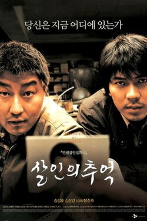

Memories of Murder is a gritty, atmospheric, and somehow darkly funny crime thriller based on a real-life serial murder case that shook South Korea in the late 1980s. This film had been on my watchlist for years, but learning that the real culprit was finally identified nearly three decades later pushed me to finally watch it. It was everything I hoped for and more.

## Context

The real-world story behind the film is fascinating enough to make anyone interested. Memories of Murder is based on the Hwaseong serial murders, South Korea's most infamous cold case, which took place between 1986 and 1991. Beyond the hunt for the killer, the film vividly captures the political climate of the era under military dictatorship.

Bong Joon Ho seamlessly weaves systemic corruption into the narrative. In one memorable scene, detectives desperately request backup to secure a crime scene, only to be denied because riot police have been deployed to suppress democratic student protests. Moments like this reflect real events such as the June Democratic Struggle of 1987 and highlight a state so preoccupied with controlling its citizens that it struggles to catch an actual murderer.

Researching the case after watching the film only made it more fascinating. In a chilling twist, the real killer, Lee Choon-jae, who was identified through DNA evidence in 2019, reportedly watched the film while in prison. Knowing that the film's final shot was intended to confront the killer directly adds another layer of tension to the experience.

One sequence in particular sent chills down my spine: two women walk alone at night in opposite directions, and by pure chance the killer chooses the schoolgirl rather than the protagonist's wife. While the film takes creative liberties with the investigation, it captures the fear, uncertainty, and helplessness that defined the period.

## Cinematography

The cinematography is remarkably deliberate. Bong Joon Ho employs slow, lingering shots that create a suffocating atmosphere while grounding the story in muddy fields, cramped interrogation rooms, and rain-soaked countryside roads.

One technique I especially loved is how the camera frequently cuts between a detective's gaze and what they are looking at. When Detective Seo discovers the murdered schoolgirl, the film alternates between his devastated reaction and the grim details of the crime scene. Rather than explaining the horror through dialogue, Bong forces the audience to observe alongside the characters. It is a powerful example of visual storytelling that allows viewers to connect the dots themselves.

## Characters and Psychological Descent

Although the lead detectives—Park Doo-man (Song Kang-ho) and Seo Tae-yoon (Kim Sang-kyung)—are fictionalized composites of the real investigators, their deeply human reactions anchor the film.

What makes them so compelling is their psychological trajectory. At the beginning, Park is a provincial detective who relies on instinct, superstition, and coercive tactics. He believes he can identify criminals simply by looking into their eyes. Seo, by contrast, arrives from Seoul as the embodiment of rationality, relying on evidence, procedure, and logic.

As the investigation drags on and more victims are discovered, the case gradually breaks them both.

Seo, haunted by his inability to stop the killings, becomes increasingly desperate. The detective who once trusted facts and process eventually abandons his principles, brutally assaults a suspect, and even pulls a gun on him.

Meanwhile, Park experiences the opposite transformation. Standing outside a dark train tunnel and staring at the same suspect, he finally realizes that his supposed gift for reading people is meaningless. He lowers his weapon and quietly admits, "I don't know. I can't tell."

Their arcs form one of the film's most devastating ideas: prolonged exposure to evil does not bring clarity—it destroys certainty. Rather than portraying heroic detectives triumphing over a criminal mastermind, the film shows ordinary people breaking under the weight of an impossible case.

## The Final Scene

The final sequence is one of the most haunting endings I have ever seen.

Years later, a retired Park Doo-man returns to the ditch where the first body was discovered. A young girl tells him that another man had recently visited the site, claiming he was simply reminiscing about something he did there long ago. When Park asks what the man looked like, she gives the most terrifying answer imaginable:

"Just ordinary."

In that moment, the film completely dismantles the myth of the cinematic monster. The killer is not a scarred villain lurking in the shadows. He is ordinary. He blends in. He could be anyone.

When Park looks directly into the camera, breaking the fourth wall, the effect is unforgettable. The gaze feels aimed not only at the real killer but also at the audience itself. The implication is deeply unsettling: the monster was never hiding somewhere far away. He was living among ordinary people the entire time.

## Director Bong Joon Ho

Before this, the only Bong Joon Ho film I had seen was Parasite, which completely blew me away. Watching Memories of Murder, I could already see the hallmarks that would later define his career: genre-blending storytelling, dark humor, social commentary, and extraordinary control of tone.

It is no surprise that he eventually became an Oscar-winning director. What impresses me most is how naturally he integrates social criticism into the story. The film never feels like a lecture. Instead, the commentary emerges organically from the characters, institutions, and circumstances surrounding the investigation.

Art without intention often feels hollow. Bong Joon Ho's work demonstrates the opposite. Every artistic choice serves a purpose, and when his vision comes together as successfully as it does here, cinema transcends entertainment and becomes something much closer to art.
