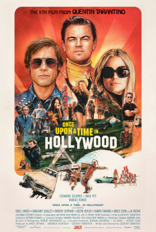

The visuals, characters were vaguely entertaining and just like the purpose of the movie, its meant to show the old Hollywood and in my opinion really  nails showing the specific time period.

The problem is that I personally ddi not grow up in this time period at all, so in terms of nostalgia or looking back fondly I don't think I was the audience that was meant to enjoy this.

## A Period in time

Even my younger generation self can identfiy the clear references to many things during this time period, like hippies, like western movies being popular, the horror movie segment at the end, Bruce Lee etc.

It really did immerse me in what it was like during this time in Hollywood.

## An end of a era

Going with the same theme of Hollywood not being the same, Brad Pitt and Leo diCaprio seems like the best actors to encompass this exact idea. Them being the last of the old holywood big name superstars, last of the actors that grew up in this type of hollywood and has this superstar power that actors use to have.

The two characters they play is similar to themselves in terms of the point in their career, along with Margot Robbie, they are growing older, starting families, becoming less relavent etc.

Similarly, the new gen that was coming feature a lot of the new upcoming actors like Austin Butler, or Syney Sweeney etc.

## Vibes only

This was a clear time-capsule and love letter tot hat period of time from Tarantino, the biggest movie nerd ever.

For someone that has no expeirence or knowledge aboutt hat time at all, I think he did a great job depicting the atmosphere and energy at that time.

Although it was enjoyable to just watch and see, the lack of any real plot definitely made the movie feel quite lackluster as someone who cannot rfeally connect emotionally to this period in time.

In all honesty, my love for Brad Pitt was enough to get me interrested in watching the movie and I would say on that front it was satisfactory.

## Conclusion

Overall it just wasn't a movie made for me and I was definitely not the target audience. Nevertheless, the acting ,overall cinematography and the atsmophere and flavor of the movie definitely gave me glimpses into old Hollywood, which unfortunately is something I just didn't connect with personally.
