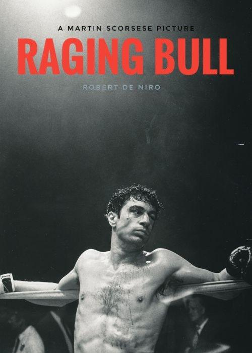

---

title: "Raging Bull (1980)"
pubDate: 2026-07-25
updatedDate: 2026-07-25
rating: "10.0"
---

I walked into this expecting a hype boxing movie along the lines of *Rocky* or *Creed*—something where I could just kick back, watch some clean hooks, and root for the underdog.

Boy, was I wrong. Calling this a "boxing movie" feels like calling *Titanic* a movie about boat maintenance.

## Character study

I’m no historian, so I can’t speak to the exact factual accuracy of Jake LaMotta’s life here, but as a pure biography and character study? This was a brutally honest, no-punches-pulled look at a deeply broken man.

We get the whole package: the meteoric highs, the catastrophic lows, and everything ugly in between. It’s a harsh reminder that while we love to idolize legendary athletes, they are painfully human, and often deeply flawed.

The tragic irony of Jake LaMotta is that the exact thing making him a fan favorite in the ring, his raw, animalistic rage, is the exact thing destroying his life outside of it. He is a literal "raging bull." Fueled by toxic insecurity and paranoia, the moment he sees red, he charges. And unfortunately, the people getting gored are the ones who love him most.

## Cinematography

I haven't watched a ton of black-and-white cinema, but here, it was clearly a masterclass in stylistic choice rather than a product of its time. And wow... this movie is *gorgeous*.

Some critics say Scorsese went monochrome to distance the film from *Rocky*, or to tone down the sheer amount of blood and sweat. Whatever the reason, it works ridiculously well. The mirror work, the high-contrast lighting, the framing, it’s elite visual storytelling from start to finish. Zero dull moments.

A few standout moments that blew my mind:

* **The Opening Shot:** Jake shadowboxing alone in the ring while classical music plays. The way the ropes are framed makes the ring look like a zoo cage for an absolute animal. That sequence is permanently burned into my brain.
* **The Fight Sequences:** They don't play out like sports broadcasts; they feel like violently choreagraphed dances. Dynamic camera moves, exaggerated punch audio, rising smoke reflecting Jake's inner heat, and that iconic dolly zoom on Sugar Ray Robinson? Chef's kiss.
* **The Jail Cell:** When Jake finally hits rock bottom and gets thrown in prison, Scorsese uses stark black-and-white shadows to make the cell look pitch-black, perfectly capturing Jake's mental state as he realizes he's lost literally everything. It simply wouldn't have had the same impact in color.

## Jealousy is a Horrible Drug

Jake’s insecurity and crippling jealousy are painful to watch. Scorsese makes you *feel* that paranoia through the camera: slow-motion close-ups on his wife casually touching another man’s hand, cutting to Jake stewing across the room. Combined with Robert De Niro’s terrifyingly good performance, you’re just sitting on the edge of your seat, waiting for the inevitable explosion.

That temper is his ultimate downfall. Eventually, everyone who ever cared about him, including his own brother, walks out. They just can't take the accusations and violence anymore.

The saddest part? He realizes it when it's already far too late. By the time he's practicing his monologue in front of a dressing room mirror at the end, the realization hits him that *he* was his own worst enemy all along.

## Overall

A total masterpiece on every single front.

It might not have the chaotic rewatch value or pure fun of *Goodfellas*, but from a technical and narrative standpoint, this might legitimately be Martin Scorsese’s absolute finest work.

A heavy, stunning, essential film that everyone needs to experience at least once.
