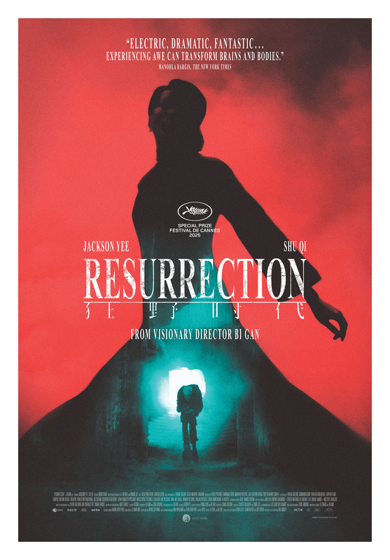

---

title: "Resurrection Bi Gan (2025)"
pubDate: 2026-05-30
updatedDate: 2026-05-30
rating: "8.1"
---

Bi Gan's Resurrection is easily his most ambitious project to date. Structured as an anthology of five distinct stories, the film traces both the evolution of Chinese history and the evolution of cinema itself. Each segment adopts a different visual language while loosely revolving around one of the five senses, creating a work that feels less like a conventional narrative and more like a journey through memory, art, and perception.

It is also one of the most frustrating films I have watched this year.

Not because it is bad, far from it, but because I spent much of its runtime desperately wanting to love it as much as I admired it.

## The Anthology Format

Anthology films can often feel disconnected, but Resurrection does a surprisingly good job of creating subtle links between its stories. There is an underlying sense that each chapter is speaking to the others, whether through recurring imagery, emotional echoes, or the progression through different eras of Chinese history and filmmaking.

Unfortunately, I found the second, third, and to some extent fourth stories considerably weaker than the opening and closing segments.

While each chapter introduces fascinating ideas and visual concepts, many of the characters felt underdeveloped, and several narratives ended before I became emotionally invested in them. I often found myself appreciating what Bi Gan was trying to achieve rather than being fully absorbed by the stories themselves.

That said, even when the film stumbles narratively, it never becomes uninteresting.

Because when Resurrection reaches its highs, they are extraordinary.

## Cinematography

Regardless of how one feels about the stories, it is impossible to deny that Resurrection is one of the most visually stunning films of recent years.

I am generally skeptical of films that prioritize aesthetics over engagement. Beautiful images alone rarely hold my attention. Yet Resurrection continually captivated me because every frame feels meticulously crafted and completely intentional.

Each story possesses its own visual identity. The colors, lighting, textures, and atmosphere shift dramatically from chapter to chapter, making every segment feel like its own cinematic universe.

The opening story was particularly memorable. Styled like a silent-era film, it embraces exaggerated sets, surreal imagery, and a dreamlike sense of playfulness. At times it felt closer to a living painting or an animated fantasy than traditional cinema. Even without dialogue, it communicates its themes with remarkable clarity.

Bi Gan's command of visual storytelling is so strong that even during the film's weaker stretches, I found myself unable to look away.

## Jackson Yee

One of the film's biggest surprises was Jackson Yee.

Prior to Resurrection, I had never seen any of his work, but after this performance I completely understand why he has become such a celebrated actor.

Playing a different role in each segment, Yee demonstrates remarkable versatility. In fact, it took me an embarrassingly long time to realize that many of these characters were being portrayed by the same actor. Whether through performance, physicality, or costume design, each incarnation feels genuinely distinct.

For a film built around transformation and reinvention, he becomes the perfect anchor.

## The Final Story

Then comes the fifth and final story. And suddenly everything clicks.

Long takes are hardly new to cinema. Films such as 1917 have popularized the technique, and countless directors have used them to showcase technical mastery. What impressed me about Bi Gan's approach is that the long take never feels like a gimmick. Instead, it becomes an essential storytelling tool.

One sequence in particular left a lasting impression on me. The camera follows a young couple wandering through neon-lit streets that evoke 1990s Hong Kong. As we settle into their perspective, the camera unexpectedly drifts away and transitions into the first-person viewpoint of another character.

Instantly, the entire emotional dynamic changes. Without any exposition, the reactions of the surrounding people tell us everything we need to know. Their expressions reveal fear. Their body language creates tension. We immediately understand that whoever we are inhabiting is important, dangerous, and commands a certain presence. It is easily one of the most inventive character introductions I have ever seen.

What impressed me most was how naturally the technique serves the story. The camera movement is dazzling, but it never exists solely to impress the audience. Every movement deepens our understanding of the world and the people within it.

The final story is not merely the best section of the film, it is one of the most memorable pieces of filmmaking I have seen in years.

Honestly, if the entire movie had maintained the quality of this final chapter, I would have given it a perfect score.

## Director Bi Gan

Resurrection left me with mixed feelings, but it also convinced me that Bi Gan is an extraordinary filmmaker.

His eye for composition is undeniable. His understanding of rhythm, atmosphere, and visual storytelling is exceptional. Few directors working today can create images this immersive or this evocative.

My main reservation lies with the storytelling itself. Throughout much of the film, I found myself searching for an emotional or thematic connection that remained just out of reach. The ideas are ambitious, but several stories lack the character depth necessary to fully realize them.

Yet the final chapter offers a glimpse of what Bi Gan is capable of when his visual brilliance and narrative instincts align.

If that segment is any indication, his best work may still be ahead of him.

## Conclusion

I honestly do not know who I would recommend this film to.

For viewers seeking a traditional narrative, Resurrection may feel self-indulgent and frustrating. For others, its visual experimentation alone may justify the experience. Part of me even wonders whether the film is better approached in pieces rather than in a single sitting.

What I do know is that the final story will stay with me for a very long time. I can already see myself revisiting it repeatedly over the coming years.

The middle portions of the film prevented me from fully embracing Resurrection as a masterpiece, but the final chapter comes astonishingly close. It transforms the film from an impressive artistic exercise into something genuinely unforgettable.
