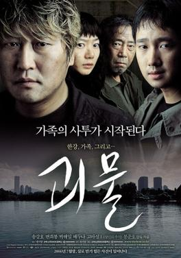

---

title: "The Host (2006)"
pubDate: 2026-06-02
updatedDate: 2026-06-02
rating: "8.0"
---

I came into the 'The Host' thinking it was going to be your usual monster movie like Jaws or Anaconda. However, in Bong Jo Hoon fashion it is always more than that, and a social critique is apparent throughout the movie.

## Context

Like Memories of Murder, The Host draws inspiration from a real event in South Korean history. In 2000, a U.S. military mortuary employee stationed in Seoul ordered large quantities of formaldehyde to be poured down a drain that ultimately flowed into the Han River. The incident sparked public outrage and became a symbol of both environmental negligence and the unequal relationship many Koreans felt existed between South Korea and the United States.

Bong Joon-ho takes this real-world event and imagines its worst possible consequence. In the film, years of toxic chemicals being dumped into the Han River cause a creature to mutate and emerge from the water, terrorizing the city. While the premise is fantastical, the underlying concern is very real: environmental damage caused by human irresponsibility.

It was clear from the beginning that Bong was interested in more than simply making a monster movie. Throughout the film, he critiques government bureaucracy, media manipulation, and the influence of the United States in South Korea. The American military is portrayed as a powerful force that often acts without accountability, while Korean authorities repeatedly prove incapable of protecting ordinary citizens.

## The Monster

That entire first sequence of the monster's appearance and rampage along the riverbank was genuinely terrifying. Bong Joon-ho's decision to reveal the creature in broad daylight rather than hiding it in the shadows makes the attack feel immediate and chaotic.

However, I often found the monster itself less frightening than the situations surrounding it. I'm not entirely sure why, but parts of the creature's design and movement felt somewhat corny to me. Some of that may simply be the limitations of mid-2000s CGI, which occasionally shows its age compared to modern visual effects.

I also think part of the reason is that Bong was never trying to make a straight horror film. Unlike Jaws, where the shark is treated as an almost mythical source of fear, the creature in The Host is frequently awkward, clumsy, and even strangely animal-like. It spends much of the film running, feeding, hiding, or trying to survive rather than behaving like an unstoppable monster. In many ways, it feels less like a horror villain and more like a wild animal reacting to a world that created it.

By the end of the film, I found myself viewing the monster as another victim of the story rather than its true antagonist. The real threat was the incompetence, negligence, and self-interest of the institutions surrounding it.

## Environmental responsiblities

The environmental message of The Host is impossible to miss. The monster itself only exists because of human carelessness. Early in the film, an American military pathologist orders toxic chemicals to be dumped down a drain and into the Han River, an act based on a real incident involving the dumping of formaldehyde into South Korea's waterways. Rather than portraying the creature as an evil force of nature, Bong Joon-ho presents it as the direct consequence of environmental negligence.

What makes the film interesting is that the monster is ultimately less responsible for the suffering than the institutions that created the conditions for its existence. Government officials, military authorities, and scientists repeatedly fail to take accountability, instead focusing on controlling public perception and maintaining authority. Even after the creature appears, the response is characterized by misinformation, panic, and bureaucracy rather than genuine concern for the people affected.

The use of Agent Yellow near the end of the film further reinforces this critique. The chemical is an obvious reference to Agent Orange, the herbicide used by the United States during the Vietnam War. By deploying another potentially dangerous chemical solution to solve a problem that was itself caused by chemical pollution, the film suggests that governments often respond to environmental disasters with the same short-sighted thinking that created them in the first place.

## Conclusion

Despite my mixed feelings about the monster itself, I still found *The Host* to be a fascinating film. What initially appears to be a straightforward creature feature quickly reveals itself to be something far more ambitious. Bong Joon-ho uses the framework of a monster movie to explore environmental negligence, government incompetence, media manipulation, and the complicated relationship between South Korea and the United States.

What impressed me most was how relevant many of these themes still feel today. The film's portrayal of institutions scrambling to control a crisis often feels more unsettling than the monster at its center. While the creature never fully worked for me as a source of horror, it succeeded as a symbol of the consequences of human irresponsibility.

In the end, *The Host* is at its best when viewed not as a monster movie, but as a social critique that happens to feature a monster. It may not rank among my favorite Bong Joon-ho films, but it is another example of his ability to take a familiar genre and use it to say something much bigger.
