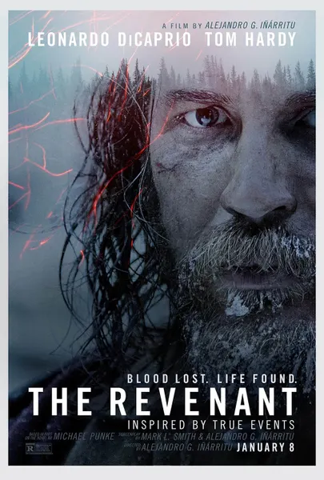

*The Revenant* is the film that finally earned Leonardo DiCaprio his long-deserved Oscar. From a technical perspective, it's about as close to perfect as a film can get. Unfortunately, despite all of its achievements, it never fully captured me emotionally.

## Cinematography

Wow. Just amazing.

Right from the opening scene, every shot in this movie is breathtaking. Whether it's the natural lighting during sunrise and sunset or the vast landscapes covered in snow, everything looks incredible. Even the nighttime scenes, lit only by fire, are beautifully photographed.

I think this naturalistic approach really helped immerse the audience in both the time period and the harsh world the characters inhabit.

The camera movement is also a very deliberate storytelling device. It mirrors the characters' movements, making every struggle feel immediate and physical.

The contrast between intimate close-ups and sweeping wide shots was especially striking. The close-ups emphasize Glass's suffering, while the wide shots constantly remind us of the overwhelming beauty of the wilderness. Ironically, this was one of the few aspects that occasionally pulled me out of the story. I'd find myself admiring the mountains, forests, and rivers so much that I'd briefly forget I was watching a brutal revenge film. Maybe that was an intentional choice by the director, but I'm not convinced it was always the right one.

## Acting

Leonardo DiCaprio's performance finally earned him his well-deserved Oscar, which probably raised my expectations going into the film.

I have immense respect for what the cast endured during production. Filming in such unforgiving and freezing conditions couldn't have been easy. However, despite the physical commitment, I can't honestly say this is a performance that completely blew me away, let alone one of DiCaprio's best.

The film also contains surprisingly little dialogue. DiCaprio does an excellent job conveying emotion through his expressions, particularly through his eyes. He also convincingly portrays the agony of Glass's horrific injuries and the sheer determination required to survive.

Maybe this role simply doesn't suit an actor as recognizable as Leonardo DiCaprio. It's difficult to completely forget that you're watching one of Hollywood's biggest stars, and that slightly reduced my immersion.

On the other hand, Tom Hardy completely disappeared into his role. I honestly didn't fully realize it was him until later in the movie when we finally got a clearer look at his face. That's a testament to both his performance and the makeup.

Hardy was easily the most engaging part of the film for me. He creates an outstanding antagonist, constantly justifying his selfish and cruel actions as necessary for survival. Every decision he makes gives the audience another reason to want Glass to catch him, and Hardy's performance is what kept me invested in the story.

## Story

At its core, *The Revenant* is a straightforward revenge story. It's set in early frontier America and is loosely inspired by the real-life frontiersman Hugh Glass, who survived remarkably similar circumstances.

Unfortunately, the story never fully grabbed me.

The movie felt extremely long, and much of it boils down to Glass tracking Fitzgerald while Fitzgerald tries to stay ahead of him. Because of this, Tom Hardy became the driving force behind my interest in the plot, as I patiently waited for his inevitable confrontation with Glass.

For me, the story is easily the weakest aspect of the film. The extraordinary cinematography kept my eyes glued to the screen, but I wasn't emotionally invested in what was happening.

## Conclusion

From a technical standpoint, *The Revenant* is exceptional. The cinematography, sound design, direction, and performances are all incredibly impressive, and there's very little to criticize in terms of craftsmanship.

The missing piece, for me, was the entertainment factor. While I appreciated the artistry on display, I found the story stretched too thin. The extended pursuit of Fitzgerald began to feel repetitive, especially when the destination—a predictable act of revenge—was never really in doubt.

Despite being one of the most visually stunning films I've ever seen, movies are ultimately meant to engage and entertain. Unfortunately, *The Revenant* never managed to do that for me.
