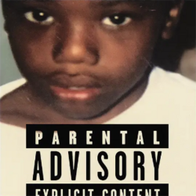

--- 
title: "Casino Baby Keem (2026)"
pubDate: 2026-02-23
updatedDate: 2026-02-23
rating: "8.8"
---

---

Honestly, I was never the biggest Baby Keem fan going into this. I'd listened to Melodic Blue and his features with Kendrick, and songs like Orange Soda had been in my rotation for years. But I always boxed him in. I thought of him as a rapper, a good one, but a rapper. Casino changed that completely.

## More Than Just a Rapper

There's a category of projects that push an artist beyond rapping into something closer to full artistry. For me the benchmarks are things like Igor and Tyler's entire evolution from Yonkers, Lil Yachty's Let's Start Here, Mac Miller's Swimming. Albums that feel like a statement of identity rather than just a collection of tracks. Casino belongs in that conversation.

The production is almost Kanye-esque in how deliberate and layered it feels. You can tell Keem is a genuine student of the game, someone who has absorbed decades of hip-hop and is now synthesising it into his own voice. The beats stay banging throughout but there's real diversity across the album, it never settles into one lane for too long.

His vocal range and delivery were another highlight. Being a huge André 3000 fan, hearing "I am not a lyricist" genuinely stopped me in my tracks. Keem's flow, cadence and the specific voice he adopts on that track had me convinced for a moment that 3 Stacks had actually come out of retirement for a feature. The Kendrick influence is audible too, particularly in how he plays with different vocal registers and tones across the project.

## The World of the Album

What really elevated Casino beyond a great rap album was how fully realised the concept is. The casino sound effects, the slot machines, the track titles, the callbacks to LA and the Short Dog feature, all of it works together to paint a vivid picture of Keem's upbringing and environment. It doesn't feel like decoration. It feels like world-building.

The three short documentaries released before the album came out did a lot of heavy lifting here too. Going into Casino with that context made the themes land so much harder. You understand the hardship he's working through, and the album stops being just an album and starts feeling like a genuine piece of autobiography.

## The Emotional Core

Underneath all the sonic ambition, Casino is an introspective record. Keem is open about his mother, his family, the abandonment he experienced growing up, and what it took to get to where he is now. The album carries that weight without ever getting heavy-handed about it.

The final track "No Blame" is a perfect closing statement. After everything he's unpacked across the runtime, he arrives at a place of acceptance rather than bitterness. He doesn't blame his mother. It's a quietly powerful way to end things, and it reframes a lot of what came before it.

## Final Thoughts

Casino is the album that made me take Baby Keem seriously as an artist rather than just a rapper, and that's not a small thing. It's cohesive, confident, and emotionally honest in a way that genuinely surprised me.

Also, Good Flirts has been on loop since it dropped. Dot's verse is too catchy and I refuse to apologise for that.
