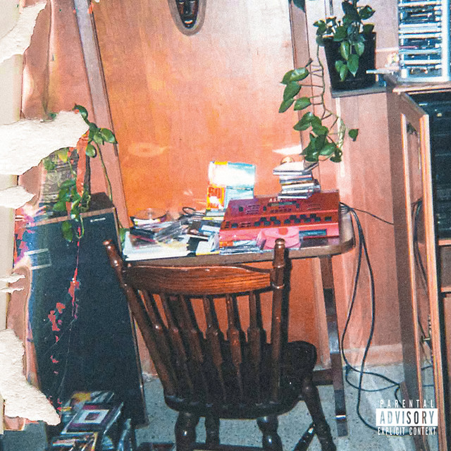

---

Upon my first listen, I was actually pretty disappointed.

Leading up to the album, *Birthday Blizzard* had me unbelievably hyped. It made me expect that Cole was about to *rap rap* for an entire album, so when *The Fall Off* finally dropped, it wasn't what I had built up in my head.

After sitting with it for a while and giving it a few more listens, though, I came away appreciating it much more.

## For the record

I'm a huge J. Cole fan.

*2014 Forest Hills Drive* was the soundtrack to my childhood, and I've listened to every studio album he's released since. More recently, I've gone back through his mixtapes, with *Friday Night Lights* becoming one of my favorites.

That era of Cole—the hungry, ambitious underdog with incredible storytelling—is still my favorite version of him.

## The Fall Off as an album

I've always felt that J. Cole's albums are slightly weaker than the sum of their individual songs, and I've never really been able to put my finger on why.

Almost every album has songs that I absolutely love and still keep in rotation, but listening to them front to back has rarely been an experience that completely captivates me.

For me, his albums often lack a strong sense of cohesion, whether sonically or thematically. The songs don't always elevate one another in the way that my favorite albums do.

*The Fall Off* continues that trend.

There are some songs that I still find myself skipping, even after multiple listens. Tracks like *Legacy* and *The Let Out* never really clicked with me. Going into this album, I expected Cole to showcase his pen from start to finish—and while he absolutely does on many tracks—I felt these songs interrupted the overall momentum.

I genuinely think the album would have been stronger if it were a little leaner. Instead of maintaining a consistent flow, I'd go from nodding my head to an incredible rap performance to wondering why Cole had suddenly switched into an R&B-inspired track. That tonal whiplash made the listening experience less enjoyable for me.

## The highs were incredibly high

Despite my criticisms of the album as a whole, the best moments are some of the strongest of Cole's career.

*Quick Stop* and *Safety* have quickly become two of my favorite J. Cole songs and have been in constant rotation since release.

There's a clear theme throughout the album of returning to Fayetteville, reflecting on fame, and coming to terms with the final stages of his career. *Lonely at the Top* was a standout for me, particularly the playground analogy and the way Cole recontextualizes the familiar phrase into something much more personal.

Cole's love for hip-hop is also on full display. Tracks like *I Love Her Again* and *The Fall-Off Is Inevitable* highlight everything that has always made him one of my favorite rappers: thoughtful writing, technical ability, and storytelling. The references and inspiration drawn from artists like Common and Nas feel genuine rather than forced, serving as a tribute to the music that shaped him (he has definitely not let him down).

## Overall

As J. Cole's final studio album, I came away satisfied.

It isn't my favorite Cole album, and I still think it's held back by pacing issues and a few unnecessary tracks. Ironically, that's also something I've consistently felt about many of his albums.

At the end of the day, though, this is Cole being Cole.

Thoughtful, reflective, deeply personal, and occasionally brilliant.

He'll always be the soundtrack to some of the best moments of my life, and while *The Fall Off* may never be my favorite album of his, several of its songs will undoubtedly stay in my rotation for years to come.
