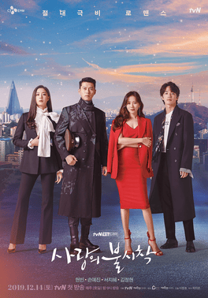

I haven't watched many K-dramas, but *Crash Landing on You* was a light, fun, and entertaining experience overall.

## Premise and World Building

The core setup of a South Korean heiress accidentally paragliding into North Korea is delightfully absurd, but it creates a unique sandbox for a romance story. While I cannot speak to the accuracy of its portrayal of North Korea, using the stark cultural and political contrast between the two countries as a backdrop led to great comedic moments and fascinating character interactions.

## Narrative and Pacing Criticisms

The story is solid, and I appreciated that the show maintained multiple ongoing subplots to keep the stakes high. The main antagonist, Cho Cheol-gang, is genuinely sharp, which added a layer of unpredictability and tension that generic romance dramas often lack. However, several structural issues held the narrative back:

* **Overreliance on Coincidences and Plot Armor:** The sheer frequency of convenient timing consistently undermined the drama. Beyond the central romance, character-saving miracles happened far too often. A prime example is the child miraculously witnessing Yoon Se-ri being kidnapped. Knowing that a perfectly timed intervention would always pop up made it hard to feel any real tension during life or death situations.
* **Gu Seung-jun's Frustrating Fate:** The decision to kill off Gu Seung-jun in the final episode felt entirely unearned. It came across as a cheap bid for emotional weight, artificially raising the stakes to hint that main characters could actually die. Throwing away his character arc and his romance with Seo Dan was a massive waste, especially given how compelling their dynamic was.
* **Editing Bloat and Exposition Loops:** The narrative structure suffered from a classic "show AND tell" problem. The show frequently had characters explicitly explain what just happened, only to follow it up with identical flashback footage. Other times, it would replay an entire scene just to add a few seconds of off-screen context. This felt like broadcast TV filler designed to pad the runtime.

Despite these flaws, the genuine emotional beats landed well. Moments like the tragedy surrounding Captain Ri Jeong-hyeok's late brother, Ri Moo-hyeok, and the grounded, gradual reconciliation between Se-ri and her mother felt sincere and gimmick free.

## Technical Execution and Cinematography

My biggest critique lies in the visual presentation. While the overall production value is clearly high, the direction repeatedly leaned on tropes that broke my immersion:

* **Exaggerated Melodramatic Editing:** The rapid multi-angle cuts of the exact same moment, aggressive slow motion, and hyper-dramatic music cues felt overly cheesy and cliché.
* **Visual Inconsistencies:** The abrupt switches to low-resolution GoPro footage during the paragliding scenes and the noticeably weak green screen work (even for 2020 standards) often pulled me out of the moment, making me laugh during scenes that were meant to be serious.

## Character Dynamics and Romance

The romantic core of the show was hit or miss, largely because the main and side dynamics were written so differently:

### The Main Couple: Ri Jeong-hyeok and Yoon Se-ri

Their romance felt somewhat manufactured because it relied heavily on the "destiny" trope. Layering on endless childhood encounters in Switzerland, a random piano melody, and forced proximity plot devices (like declaring Se-ri his fiancée or the sudden kiss on the boat) made their connection feel dictated by the script rather than built naturally.

Furthermore, their affection seemed to grow more from distance and the fear of loss than from actual shared time. Constant tearful goodbyes and an ultimate dynamic where they only see each other once a year made the relationship feel rooted in longing rather than day to day connection.

### The Second Lead Couple: Gu Seung-jun and Seo Dan

In contrast, Gu Seung-jun and Seo Dan carried the most genuine romance in the series. Their relationship blossomed naturally through small, grounded interactions: sharing normal conversations, eating noodles together, and leaning on each other during vulnerable moments. Their dynamic felt earned, which made Seung-jun's ultimate fate all the more frustrating.

## Overall

The Korean humor, military squad banter, and lively ensemble cast made *Crash Landing on You* a thoroughly enjoyable watch. While the main romance relied a bit too heavily on fate and the plot armor occasionally diluted the tension, the charm of the characters and the unique setting made it worth the ride.
