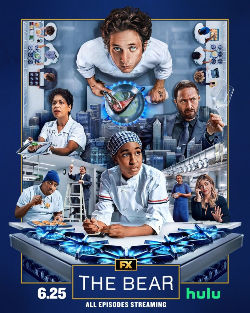

The Bear has officially wrapped up its final season. It is hard to break down every single season individually, especially since memories of the early years fade a bit over time, but looking at the big picture, this show was a whole experience.

## Top Tier Human Drama

When a show relies on human drama, the characters have to be absolute powerhouse creations. The cast here completely carried the entire series. While the setting is technically a bustling Chicago restaurant, the kitchen is really just a high pressure background for these amazing people to collide with each other.

The writers made the audience fall in love with these misfits. They feel real, messy, and deeply human. If you have been lucky enough to have people you love like this in your own life, you know this is exactly what family feels like. Stress and hardship push everyone to their absolute limits. Things get super heated, especially in a pressure cooker like the Bear, but love is always underneath it all. You might love them today and want to yell at them tomorrow, but true family bonds are not so fragile that a bad day breaks them.

The dialogue and interactions feel so believable. We start with a ragtag crew trying to save a failing sandwich shop buried in debt. We see all their flaws upfront, but watching them grow over five seasons was wildly satisfying. They were far from perfect by the finale, but the core cast earned their arcs. Even if I am still mulling over a few specific choices in the ending, it was always about the journey, the massive highs, and the crushing lows.

## Cinematography, Vibe, and Perfect Pacing

I really loved the cinematography, the pacing, and the overall aesthetic. One of my biggest issues with modern television is how bloated seasons can feel. So many shows stretch out to hit a ten episode mandate, packing in cheap cliffhangers or unnecessary filler just to keep people hooked for another week. I usually prefer stories that keep moving without the fluff.

The Bear completely dodged those TV traps. Episode lengths varied naturally, and the directorial choices shifted from episode to episode. That approach allowed for self contained stories that worked as brilliant standalone mini movies while still pushing the main plot forward. It kept the pacing dynamic and fresh.

### Giving scenes room to breathe

The camerawork gave the actors actual room to perform. Instead of rapid fire cuts, the camera often just sat there and let the interactions build. It worked insanely well for emotional moments, making you feel like you were standing in the room during an intimate, private conversation. In the later seasons, the heavy use of tight close ups put every micro expression right in your face during intense talks, turning up the emotional realism.

### Gorgeous food art

The food shots were pure eye candy. The plates were colorful, creative, and gorgeous. I loved that they used real, stunning culinary creations rather than fake props. Marcus making his desserts was a personal highlight for me; everything he plated looked top tier. I have not looked into all the real world chefs behind the scenes who designed those dishes yet, but I would eat every single item in a heartbeat.

### Building pure stress and tension

The show is a masterclass in building panic. When all hell breaks loose during service, watching the kitchen spiral is pure entertainment. The early seasons in particular were non stop kinetic energy. The sound design alone gives you an actual spike of adrenaline.

I still remember the iconic episode where the online ordering system was accidentally left open for pre orders. That ticket machine printing out a endless stream of orders with that relentless chittering sound, echoing over heated arguments while the paper stack grew into a mountain, stressed me out to my core. It gave me a whole new level of respect for real line cooks and kitchen staff. That is a job I could never do.

## Seasons 1 through 3 versus the Later Years

The first three seasons were pretty close to perfection for me. They were fast, chaotic, wildly stressful, and I devoured every episode. Time would completely disappear because so much was happening on screen at once.

From an pure entertainment standpoint, that early run was electric. The shift toward more quiet, introspective character studies in the later seasons was still solid, even if it felt a tiny bit weaker by comparison. That said, I still loved seeing the characters outside of their job titles. Richie going to work at Ever is easily one of my favorite episodes of the entire series. His redemption and personal growth was the most rewarding arc to watch unfold.

## The Carmy Dilemma

Carmy was portrayed as a tortured, crazy genius. He was so utterly obsessed with cooking that he burned down everything outside of it, including his health, his family, his romance, and his own peace of mind. Throughout the show, we watch him repeatedly hurt the people who care about him most.

Through the early seasons, the trauma inflicted by his abusive former mentor hung over him like a cloud. When they finally had their big confrontation in season three, his mentor doubled down, claiming that exact cruelty made Carmy great.

They planted so many fascinating seeds for Carmy. I loved his intense monologues in his support group meetings where he unpacked his past. Yet, I am not completely sold on how his whole journey wrapped up. Between his complex relationship with his mother, grieving his brother, hurting Claire, his dynamics with Syd and Richie, and then his sudden pivot to quit and become an architect, I felt a bit conflicted.

There was closure for most of his storylines, but it did not feel entirely seamless to me. I thought his unresolved kitchen trauma would remain a central thematic thread, especially as we watched Sydney start having her own panic attacks caused by Carmy repeating those exact toxic behaviors.

## A World Class Supporting Cast

Even with my mixed feelings on Carmy's final trajectory, the supporting characters were spectacular. Watching Richie, Tina, Sydney, Sugar, Donna, the flashback moments with Mikey, the Facks, and Uncle Jimmy was an absolute joy. They were human beings you genuinely wanted to root for. Despite their huge flaws, they were trying their best, and there is something deeply admirable about that.

The ensemble had such magnetic chemistry that I could have watched them sit in a room and just talk about random nonsense for hours. That group dynamic was the real heartbeat and charm of the show.

## Unforgettable Television

The Bear delivered some truly legendary, unforgettable television moments. That chaotic, pressure cooker family dinner episode alone is burned into my brain forever.

I loved these characters and I loved the journey. The show managed to feel like a high art indie project while never forgetting how to be thrilling, funny, and deeply entertaining. It is a absolute achievement. I hope that modern tv shows will pivot to this type of story telling ,and not feel the need to bloat the shows for the sake of increasing views and trust that a good product will naturally retain its audience.
