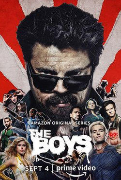

--- 
title: "The boys S1-S5"
pubDate: 2026-06-07
updatedDate: 2026-06-07
rating: "8.5"
--- 

The final curtain has officially closed. With Season 5 wrapping up the main storyline in 2026, a massive, bloody chapter in TV history comes to an end. It’s been wild journey, and I wanted to lock down my immediate, unfiltered thoughts while the finale is still fresh.

## The Season 5 Review: A Disappointing Finish

Right off the bat: Season 5 was, unfortunately, a letdown.

Ever since the show started steering away from the source material, the million-dollar question was always: *How are they going to kill Homelander?* I actually loved that they chose to forge their own path. Switching up Black Noir’s comic identity (where he’s a literal Homelander clone meant to execute him) was a brilliant creative move.

But the actual execution of his downfall? While Homelander's final moments carried *some* satisfaction, the buildup felt like a total rerun of Season 3.

**My Take:** The White House showdown was essentially the exact same fight we got in the Herogasm/Vought tower eras. They just swapped out Soldier Boy's raw power for a less hype, less satisfying combo of Ryan and Kimiko.

I was holding out for something smarter—dark schemes, complex mind games, and the boys tiptoeing that razor-thin line between hero and villain that made the early seasons elite. Instead, the final season threw away its best leverage (like the supe-killing virus plotline) to deliver a standard, cookie-cutter final showdown.

Everything felt incredibly rushed. Subplots were skipped, characters flipped sides between episodes with zero whiplash protection, and major arcs fell flat:

* **Ryan** barely had a role to play despite seasons of buildup.
* **Kimiko** suddenly regained her speech out of nowhere.
* **Mother's Milk** got zero meaningful closure with his family.
* **Hughie and Butcher's** final dynamic lacked the breathing room to deliver the massive emotional payoff we deserved.

---

## The Journey: Why 'The Boys' Will Still Go Down in History

Despite a weak finish, the show as a whole is a triumph. It arrived at the absolute perfect cultural moment—right when standard superhero media was suffocating us in droves. An aggressive, borderline-parody antithesis to the MCU was exactly what we needed (which is likely why *Invincible* exploded around the same time).

Seasons 1 through 3 were an absolute delight. The gritty realism of Vought's world separated it from the sterile hero tropes we were used to. Combined with razor-sharp parallels to real-world American media and politics, it built a fascinatingly cynical universe that felt exactly how society would actually react if super-powered narcissists walked among us.

---

## What Made It Work (Before the Finale Rushed It)

Looking back, the legacy of the show boils down to three core strengths:

* **The Humanity of the Supes:** They weren't just archetypes; they felt like deeply flawed, deeply messed-up people who just happened to be handed god-like powers.
* **Societal Commentary:** The writers deserve massive credit for how accurately they mirrored modern polarization—using mass media control, conspiracy cover-ups, and the pro-vs-anti supe movements to capture the chaotic state of modern political culture.
* **Antony Starr’s Homelander:** Brilliant. Terrifying. Unmatched. Starr’s performance is one for the history books and arguably the anchor that kept the show alive. He masterfully walked the tightrope between a murderous god and an insecure, immature child with deep-seated issues. Early on, his pure unpredictability drove the tension through the roof. You genuinely felt like *anyone* could be obliterated at any second. Plot armor didn't exist yet, and it was glorious.

---

## Final Verdict

I still love *The Boys*. Even with a forgettable, forced final season that threw away years of meticulous buildup just to cross the finish line, the highs of this show are unforgettable (and occasionally traumatizing). Its peak was taking our favorite hero tropes, giving them a nefarious vice, and making the absurdity feel terrifyingly grounded.

Ultimately, it succumbed to the classic industry curse: commercialism and the temptation of a fast finish. But if there's a silver lining, at least *The Boys* ended sooner rather than later. It died with its core identity somewhat intact, rather than being milked completely dry for another five seasons of garbage.

We won't get a show this vulgar, brilliant, and mainstream again anytime soon. I'm going to miss the memes, the madness, and the absolute **diabolical** chaos.
