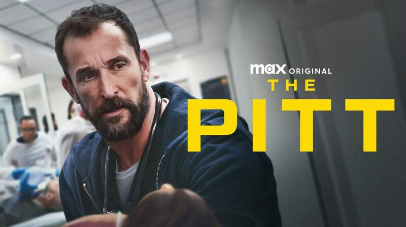

--- 
title: "The Pitt Season 1 & 2 (2025)"
pubDate: 2025-04-22
updatedDate: 2025-04-22
rating: "9.7"
--- 

*The Pitt* is easily one of the most compelling new shows to drop recently, and it made massive waves the second it landed. Its realistic, breathless depiction of emergency room chaos feels entirely unprecedented—which is wild, considering we’ve had decades of hospital-related procedurals on television.

Somehow, it strips away the tired tropes and gives us something completely visceral. S2 picks up exactly where S1 picks off with just another single day of work.

## The 15-Hour Gimmick That Actually Works

What sets *The Pitt* apart is its structural brilliance. The entire 15-episode first season chronicles a single, grueling 15-hour ER shift at a Pittsburgh teaching hospital, running essentially in real-time (one episode equals one hour).

The show is purely character-driven; there isn’t some massive, convoluted overarching plot. Instead, it’s just normal, deeply exhausted people trying to survive their shift. The setting rarely leaves the walls of that frantic emergency room, yet the writing is so sharp that the 15-hour runtime never feels stale or sluggish. It moves with a relentless, anxiety-inducing pace.

---

## Unforgettable Characters (Even the One-Episode Guests)

Noah Wyle anchors the chaos perfectly as Dr. Michael "Robby" Robinavitch, playing a veteran doctor who isn't a flawless hero, but rather a leader carrying heavy, post-COVID exhaustion and PTSD. Alongside him, the new crop of residents and medical students (like the brilliant but socially awkward Dr. Mel King and the cocky Dr. Trinity Santos) feel instantly distinct.

But the real magic of *The Pitt* is how it treats its patients.

 The Secret Weapon I’m still not entirely sure how the writers manage to make us care so deeply for patients who only appear for a single episode or sometimes just a few minutes of screen time.

Take the premiere episode, where a non-English speaking woman named Minu is rushed in with a horrific "degloved foot" injury after being pushed onto subway tracks. Within minutes, you are entirely locked into her survival and the trauma of her rescuer. The audience immediately empathizes with them because the realism of the show makes it impossible *not* to. There are no melodramatic twists; it’s just the raw, intense gravity of people facing the worst day of their lives.

---

## Human Drama Over Soap Opera

Even with the occasional hint of classic primetime drama—like secret medical struggles or the personal friction between residents—the overarching theme remains deeply grounded. *The Pitt* doesn't pander to the audience, nor does it feel like a preachy lecture.

Instead, it highlights the heavy "moral injury" of modern healthcare. It forces us to witness the tedious paperwork, the systemic underfunding, and the brutal pacing of an overworked urban hospital. It finds fascinating shades of gray in how these doctors handle the pressure, occasionally showing their own biases, flaws, and breaking points.

This show gives you a profound appreciation for healthcare workers. Seeing the staggering mental, emotional, and physical demands of the job makes it clear that empathy is the core message driving every single episode.

We rarely know what the people around us are going through. A doctor's entire job is to gently extract that hidden pain and history from a total stranger under extreme duress. Watching that process play out is incredibly endearing. It really made me reflect on my own life, serving as a powerful reminder that in a chaotic world, a little extra patience can go a long way.

## Season 1 Finale: Running on Adrenaline

Wow. Just... wow.

The absolute chaos and despair of that final hour left me completely breathless. The most insane part of the finale isn't just the sheer scale of the crisis they endure; it’s the quiet, heavy realization that as soon as this grueling 15-hour shift ends, tomorrow is just another day. The waiting room fills right back up, and they have no choice but to show up, push through the exhaustion, and keep going.

The finale felt like a massive, emotionally draining payoff for all the tiny narrative seeds the writers planted so carefully earlier in the season. Everything came crashing together beautifully, especially the heartbreaking threads connecting the victims of the PittFest mass casualty event to the personal lives of our core staff.

Seeing characters like Dr. Robby pushed to their absolute psychological breaking points—while trying to process his own deep-seated pandemic trauma on the anniversary of his mentor's death—was masterfully done. *The Pitt* didn't rely on cheap, explosive cliffhangers to hook us for a second season. Instead, it delivered something much more real: a bitter-sweet toast to the people saved, the lives lost, and the relentless, moving gear of a broken healthcare system. I am completely locked in for what comes next.

## Final Verdict

*The Pitt* succeeds because it trusts its actors and its formatting. It trades CGI spectacle and forced cynicism for a claustrophobic, beautiful realism. By the time the season culminates in a massive, overwhelming mass-casualty event testing the staff to their absolute breaking points, you realize you haven't just watched a television show, you’ve survived a shift right alongside them.
