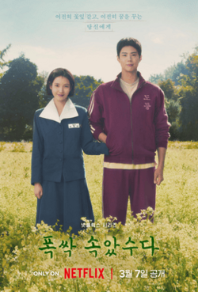

I was amazed and shocked at how good this show turned out to be. When I first saw that IU was cast as the main character, I honestly thought it was going to be a pretty cliché K-drama using her as the main selling point just to draw in her massive existing fanbase. Man, I could not have been more wrong.

## A Story About Life, Family and Resilience

While it is a love story, it definitely was not the cheesy romance show I was expecting. Instead, I got an incredible story about life itself, covering love for your partner, your family, how trauma can be passed down, and how fractured relationships can actually be rebuilt. It was just insanely grounded in realism. I really felt so many of the emotional moments because they are, unfortunately, things that almost everyone will go through at some point. It captures losing your parents, losing a partner, seeing your kids grow up and make you proud, watching your parents grow old and weaker, struggling with finances, and seeing parents sacrifice their own dreams for their children. There are just so many moments in this show where I am sure almost anyone will find something they can personally relate to. It really portrayed the ups and downs of life, showing how this ebb and flow is normal and how the little things shared with the people you love are what truly make life worth living.

I also really liked the non linear storytelling. Jumping back and forth across different eras worked great, especially getting to see an older version of the main couple. Showing an elderly couple's romance as a central plot is something that almost never happens in K-dramas, and it added such a unique depth to the narrative.

## Nuanced Portrayals of l

I absolutely loved how the show portrayed all different forms of love, not just romantic. The familial love shown is something I am blessed enough to relate to in my own life. A parent's love for their children is on full display here through their countless sacrifices and giving up their own dreams. To me, when you willingly put someone else's needs above your own without expecting anything in return, that is true love, whether it is in family, friendship, or romance.

When it comes to romantic love, the main couple of Ae-sun and Gwan-sik portrayed it in one of my favorite ways possible. It was not built on cheesy moments, but on sacrifice, commitment, and endurance. Their bond felt like the ideal version of love because it endured through countless real problems: having no money, families that did not like each other, sickness, health, the loss of their first child, and growing old together. Their love was true, and it is something I hope everyone gets the pleasure of experiencing.

## Acting

The entire cast did such a fantastic job, and all the emotional scenes were handled exceptionally well. Whether it was IU crying for the hundredth time in the show, Yang Gwan-sik silently grieving, or Park Bo-gum as young Gwan-sik crying while trying so hard to pretend to be strong for his family, every single performance was so well acted and realistic to me. I felt like I recognized all these different types of reactions from people in my own family or circle of friends. IU in particular completely surprised me. I have only ever known her as the singer IU, but after this, she honestly might have more talent as an actress than a singer. I am really looking forward to watching more of her work.

## Overall

This is a show I would definitely recommend to anyone, and I just hope people watch it in time to truly appreciate their families, relationships, and loved ones while they still can. I am really looking forward to rewatching it when I am older, when I might have even more relatable life experiences under my belt, and I am fully prepared to bawl my eyes out all over again.
