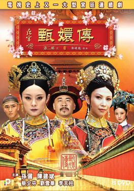

---
title: "Empresses in the Palace (The Legend of Zhen Huan)"
pubDate: 2025-10-28
updatedDate: 2025-10-28
rating: "10.0"
--- 

This was my first time ever diving into a Chinese drama. Historical palace intrigues are not usually the kind of shows I binge watch, but wow, this one kept me completely hooked from start to finish.

## A Fascinating Look Into Imperial History

I have not seen many historical dramas in general, certainly none from China. I have read webtoons, manga, and watched anime with similar themes, but seeing actual actors bring that era to life on screen was a whole different experience.

The historical setting was just as fascinating as the personal drama. The political games, the strict hierarchy, and the sheer tension within the inner court of the Emperor were incredible to watch. Seeing how the wives and concubines navigated power dynamics, secret poisonings, and court rules gave me a fascinating glimpse into historical culture. Everything from the symbolic meaning behind royal gifts to traditional medicine practice was super interesting to learn about.

The production values were out of this world. The sets, the intricate costume design, the hair, and the makeup felt totally immersive. It added a level of authentic detail that I deeply respected. They clearly did not cut any corners, and you have to admire the sheer scale of the effort.

## Theatrical Presentation and Stage Like Acting

The camera work and scene compositions felt very unique, almost like watching a classic stage play rather than a standard modern TV show. The deliberate framing and grand set pieces actually reminded me a bit of Akira Kurosawa's film Ran, where the visual structure and dramatic delivery give everything a theatrical weight.

It fit the regal atmosphere perfectly. Sure, I had a quick laugh once or twice at some of the more dramatic overacting, but it never took away from the story. If anything, it added to the grandeur.

## Schemes Within Schemes

The heart of the show is the relentless power struggle between the concubines as they compete for the favor of the Emperor. Watching these brilliant, calculating characters use every underhanded method imaginable where winning was all that mattered was wildly entertaining. The plot was packed with so many twists and turns that hitting next episode was practically automatic.

Our main character, Zhen Huan, starts out just wanting a peaceful life away from the cutthroat politics of the court, but the system simply will not let her exist in peace. Her journey to the top is brutal. It is filled with betrayal, heartbreak, and constant danger where she nearly loses her life multiple times, including the tragic loss of her unborn child. Watching her transform from an innocent young woman into a master strategist was incredible television.

## Hua Fei: An Unforgettable Antagonist

Hua Fei was the main antagonist for a huge chunk of the show, and her screen presence was absolute perfection. You could feel her authority and the sheer terrifying pressure she put on everyone in the room the moment she walked in.

Even though she eventually met her demise after a meticulously planned plot brought her down, her final scene was easily one of my favorite moments in the entire series. Seeing Zhen Huan finally free from her reign of terror was satisfying, yet you could not help but feel a wave of sympathy for Hua Fei as she confessed her twisted, desperate love for the Emperor.

Even in her final moments, she had such a commanding energy that I half expected her to somehow survive and claw her way back to power again. She was an extraordinary villain who forced all the other characters to step up their game just to defeat her.

## The Tragedy of Imperial Romance

While romance is a core element, the show handles love in a painfully realistic way. Zhen Huan begins her journey naive and hopeful, wishing for genuine romance with the Emperor. Over time, we watch that optimism wither away until affection becomes nothing more than a strategic tool she uses to protect herself, her children, and her allies.

Her one shot at true, selfless love with the Prince ends in pure tragedy when he makes the ultimate sacrifice to protect her from the Emperor's suspicion. The series is deeply tragic, but it feels painfully accurate to how trapped these women were in real life. I read that many of these court dynamics were loosely inspired by real historical accounts, which makes the dark schemes hit even harder.

## Final Thoughts

This was a phenomenal introduction to Chinese historical drama, and honestly, the bar has been set ridiculously high for anything else in the genre. As a piece of art, it succeeded on every level, from the breathtaking costumes and grand sets to the stellar performances and unforgettable characters. It is a masterpiece of storytelling that delivers on every front.
